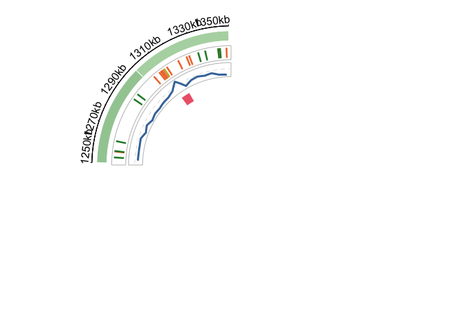

ecDNA_replication
================
Pauline L. Pfuderer
2025-03-28

# ecDNA replication is disorganised and vulnerable to replication stress

## 00. Setup

- To render html:
  `rmarkdown::render("analysis.Rmd", output_file = "/Users/pfuderer/Documents/PhD/output/ecDNA_manuscript/20250328_circos_plot/analysis.html")`
- Please note: the custom backbone file for the circos plots is uploaded
  in the GitHub repository as
  `basic_ecDNAseq_indexfile_formatted_cytoband.txt`

``` r
# set date and main_dir
date <- '20250328'
main_dir <- file.path("/Users/pfuderer/Documents/PhD/output/ecDNA_manuscript", 
                      paste0(date, "_circos_plot"))

# subdirectories
subdirs <- c("figure_01", 
             "figure_03", 
             "figure_04", 
             "figure_05", 
             "figure_supp_02")

# create the main directory if it doesn't exist
if (!dir.exists(main_dir)) {
  dir.create(main_dir)
}

# create subdirectories and name variables
for (sd in subdirs) {
  # full path
  sub_path <- file.path(main_dir, sd)
  # variable named after the subdir
  assign(sd, sub_path, envir = .GlobalEnv)
  # create the subdir
  if (!dir.exists(sub_path)) {
    dir.create(sub_path)
  }
}
```

## 01. Load libraries

``` r
library("circlize")
```

    ## ========================================
    ## circlize version 0.4.16
    ## CRAN page: https://cran.r-project.org/package=circlize
    ## Github page: https://github.com/jokergoo/circlize
    ## Documentation: https://jokergoo.github.io/circlize_book/book/
    ## 
    ## If you use it in published research, please cite:
    ## Gu, Z. circlize implements and enhances circular visualization
    ##   in R. Bioinformatics 2014.
    ## 
    ## This message can be suppressed by:
    ##   suppressPackageStartupMessages(library(circlize))
    ## ========================================

``` r
library("dplyr")
```

    ## 
    ## Attaching package: 'dplyr'

    ## The following objects are masked from 'package:stats':
    ## 
    ##     filter, lag

    ## The following objects are masked from 'package:base':
    ## 
    ##     intersect, setdiff, setequal, union

``` r
library("ComplexHeatmap")
```

    ## Loading required package: grid

    ## ========================================
    ## ComplexHeatmap version 2.18.0
    ## Bioconductor page: http://bioconductor.org/packages/ComplexHeatmap/
    ## Github page: https://github.com/jokergoo/ComplexHeatmap
    ## Documentation: http://jokergoo.github.io/ComplexHeatmap-reference
    ## 
    ## If you use it in published research, please cite either one:
    ## - Gu, Z. Complex Heatmap Visualization. iMeta 2022.
    ## - Gu, Z. Complex heatmaps reveal patterns and correlations in multidimensional 
    ##     genomic data. Bioinformatics 2016.
    ## 
    ## 
    ## The new InteractiveComplexHeatmap package can directly export static 
    ## complex heatmaps into an interactive Shiny app with zero effort. Have a try!
    ## 
    ## This message can be suppressed by:
    ##   suppressPackageStartupMessages(library(ComplexHeatmap))
    ## ========================================

``` r
library("readr")
```

## 02. Colors and legends G4, GC-content, genes, origins from literature

- origins from literature: Akerman et al., 2020 & Guilbaud et al., 2022

``` r
#------------------------------------- 01 G4 -------------------------------------

# 01: G4Hunter

g4_color = "#AA3377" #FB9A29

# 01.1: read in
lines <- readLines("/Users/pfuderer/Documents/PhD/output/DNAscent/Jedrek_csv/20240529_G4Hunter/Results_basic_ecDNAseq_indexfile_formatted/basic_ecDNAseq_indexfile_formatted-W25-S1.0.txt")

# 01.2: loop through all lines
results <- list()
chromosome <- NULL
for (line in lines) {
    if (startsWith(line, ">")) {
        chromosome <- sub("^>", "", line)
    } else if (grepl("^\\d+\\s+\\d+", line)) {
        fields <- strsplit(line, "\\s+")[[1]]
        result <- data.frame(
            Chromosome = chromosome,
            Start = as.integer(fields[1]),
            End = as.integer(fields[2]),
            Score = as.numeric(fields[5])
        )
        results <- append(results, list(result))
    }
}

# 01.3: combine into one df
g4hunter_df <- bind_rows(results)

# 01.4: filter and format for circos
colnames(g4hunter_df) <- c("chromosome", "start", "end", "SCORE")

# threshold 1.5
g4hunter_filtered_df_15 <- g4hunter_df %>%
                        filter(SCORE >= 1.5)

g4hunter_filtered_df_15$type <- "G4"

#------------------------------------- 01.1 G4 SEGMENTATION -------------------------------------

# 00: read in cytoband.df
cytoband.df = read.table("/Users/pfuderer/Documents/PhD/genomes/basic_ecDNAseq_indexfile_formatted_cytoband.txt", colClasses = c("character", "numeric","numeric", "character", "character"), sep = "\t")

# 02: functions

# 02.1: create X kb segments (50 kb default) for each chromosome
create_segments_g4 <- function(chrom, start, end, segment_size = 50000) {
  segment_starts <- seq(from = start, to = end, by = segment_size)
  segment_ends <- pmin(segment_starts + segment_size - 1, end)
  data.frame(chromosome = chrom, start = segment_starts, end = segment_ends)
}

# 02.2: apply the function to each row of cytoband.df
# 50 kb
segments_df_g4_50000 <- cytoband.df %>%
  rowwise() %>%
  do(create_segments_g4(.$V1, .$V2, .$V3, segment_size = 50000)) %>%
  ungroup()


# averaging for correlations 2.0 threshold
# define function
calculate_g4_count <- function(segment, g4_df) {
  g4_in_segment <- g4_df %>%
    filter(
      chromosome == segment$chromosome &
      end >= segment$start &
      start <= segment$end
    )
  g4_count <- nrow(g4_in_segment)
  return(data.frame(
    chromosome = segment$chromosome,
    start = as.integer(segment$start),
    end = as.integer(segment$end),
    g4_count = g4_count
  ))
}

# apply function
# 50 kb segments G4 threshold = 2.0
g4_counts_df_50000 <- segments_df_g4_50000 %>%
  rowwise() %>%
  do(calculate_g4_count(., g4hunter_filtered_df_15)) %>%
  ungroup()

write.csv(g4_counts_df_50000, paste0(figure_supp_02, "/", "g4_50000", ".csv"))

# legends
# 50 kb
col_fun_g4_50000 <- colorRamp2(breaks = c(
                                 min(g4_counts_df_50000$g4_count[g4_counts_df_50000$g4_count > 0], na.rm = TRUE), # smallest value excl. 0
                                 max(g4_counts_df_50000$g4_count, na.rm = TRUE)), 
                      colors = c("#E7D4E8", "#762A83"))

legend_breaks <- c(c(
                     min(g4_counts_df_50000$g4_count[g4_counts_df_50000$g4_count > 0], na.rm = TRUE), # smallest value excl. 0
                     max(g4_counts_df_50000$g4_count, na.rm = TRUE)))

legend_colors <- col_fun_g4_50000(legend_breaks)

legend_labels <- sprintf("%.0f", legend_breaks)

lgd <- Legend(col_fun = col_fun_g4_50000,
              at = legend_breaks,  # labels and ticks position
              labels = legend_labels,  # labels for breaks
              title = "G4 count >= 1.5, 50 kb",  # title of the legend
              labels_gp = gpar(fontsize = 10, col = "black"),  # label appearance
              title_gp = gpar(fontsize = 14, fontface = "bold"),
              grid_width = unit(5, "mm"),  # width of the color block
              border = FALSE)  # remove border

pdf(paste0(figure_supp_02, "/", "legend_g4_50000", ".pdf"))
grid::grid.newpage()
grid::grid.draw(lgd)
dev.off()
```

    ## quartz_off_screen 
    ##                 2

``` r
#------------------------------------- 02 GC -------------------------------------
# 02: GC content

gc_color = "#4477AA" #'#D9F0D3' -> '#1B7837'

# 02.1: read in csv from python script gc_content
gc.df <- read.table("/Users/pfuderer/Documents/PhD/output/DNAscent/Jedrek_csv/20240529_G4Hunter/20240529_gc_content_5000_bp.csv", header = TRUE, sep = ",")

# 02.2: format for circos 5 kb
gc_df <- data.frame(chromosome =  gc.df$chromosome, 
                          start = gc.df$start, 
                          end = gc.df$end, 
                          score = gc.df$GC_content,
                          type = "GC_content") # for HSR


# additional GC averaging segment sizes
# 50 kb
gc.df <- read.table("/Users/pfuderer/Documents/PhD/output/DNAscent/Jedrek_csv/20240529_G4Hunter/20240529_gc_content_50000_bp.csv", header = TRUE, sep = ",")
gc_df_50000 <- data.frame(chromosome =  gc.df$chromosome, 
                          start = gc.df$start, 
                          end = gc.df$end, 
                          score = gc.df$GC_content,
                          type = "GC_content") # for HSR

write.csv(gc_df_50000, paste0(main_dir, "", "gc_50000", ".csv"))

# 50 kb
col_fun_gc_50000 <- colorRamp2(breaks = c(
                                 min(gc_df_50000$score[gc_df_50000$score > 0], na.rm = TRUE), # smallest value excl. 0
                                 max(gc_df_50000$score, na.rm = TRUE)), 
                      colors = c("#FFF7BC", "#FB9A29"))

legend_breaks <- c(c(
                     min(gc_df_50000$score[gc_df_50000$score > 0], na.rm = TRUE), # smallest value excl. 0
                     max(gc_df_50000$score, na.rm = TRUE)))

legend_colors <- col_fun_gc_50000(legend_breaks)

legend_labels <- sprintf("%.0f", legend_breaks)

lgd <- Legend(col_fun = col_fun_gc_50000,
              at = legend_breaks,  # labels and ticks position
              labels = legend_labels,  # labels for breaks
              title = "GC content % 50 kb",  # title of the legend
              labels_gp = gpar(fontsize = 10, col = "black"),  # label appearance
              title_gp = gpar(fontsize = 14, fontface = "bold"),
              grid_width = unit(5, "mm"),  # width of the color block
              border = FALSE)  # remove border

pdf(paste0(figure_supp_02, "/", "legend_gc_50000", ".pdf"))
grid::grid.newpage()
grid::grid.draw(lgd)
dev.off()
```

    ## quartz_off_screen 
    ##                 2

``` r
#------------------------------------- 03 GENE NAMES & HSR DELETION REGION -------------------------------------

# 01: add genes myc and pvt-1
# ecDNA spans chr8: 126425747-127997820 and c-Myc is 127735434-127742951 -->  c-Myc on ecDNA: 1309687-1317204 and PVT-1 on ecDNA: 1368794 - end of ecDNA

# 01.1: define gene positions
myc_color <- "#EE6677"
pvt1_color <- "#66CCEE"

labels_df <- data.frame(
  chromosome = c("chr8_126425747-127997820", "chr8_126425747-127997820"),
  start = c(1309687, 1368794),
  end = c(1317204, 1572074),
  label = c("c-MYC", "PVT1"),
  color = c(myc_color, pvt1_color),
  value = 1)

# 02: HSR deleted region
# in brackets are ecDNA coordinates
# 126,695,000-127,005,000 (269,253-579,253)
# 127,744,000-127,848,000 (1,318,253-1,422,253)

# 02.1: define positions
HSR_deleted_df <- data.frame(
  chromosome = c("chr8_126425747-127997820", "chr8_126425747-127997820"),
  start = c(269253, 1318253),
  end = c(579253, 1422253),
  origin = NA,
  density = NA,
  GC_content = NA,
  fork_speed = NA,
  stall_score = NA,
  SCORE = NA,
  type = "overlay")

#------------------------------------- 04 ALL GENES -------------------------------------

# genes (not all included, as just for orientation):
# PCAT1 126,556,323..127,419,050 --> 130576 -993303
# (Name:    CASC19 Location:    complement(127,072,694..127,227,541) )
# (POU5F1B Location:    127,322,183..127,420,066 --> 994319 - 896436 )
# (Name:    CASC11 Location:    complement(127,686,343..127,739,022) )

pcat1_color <- "#BBCC33"

labels_all_df <- data.frame(
  chromosome = c("chr8_126425747-127997820", "chr8_126425747-127997820", "chr8_126425747-127997820"),
  start = c(1309687, 1368794, 130576),
  end = c(1317204, 1572074, 993303),
  label = c("c-MYC", "PVT1", "PCAT1"),
  color = c(myc_color, pvt1_color, pcat1_color),
  value = 1  # Adding a dummy numeric column
)

#------------------------------------- 04 ALL GENES NO G4 -------------------------------------

legend_values <- c("GC content", "c-MYC", "PVT1", "PCAT1")
legend_colors <- c(gc_color, myc_color, pvt1_color, pcat1_color)

lgd <- Legend(at = legend_values, labels = legend_values, 
              legend_gp = gpar(fill = legend_colors), title = "Sequence")

pdf(paste0(figure_03, "/", "legend_sequence_all_noG4", ".pdf"))
grid::grid.newpage()
grid::grid.draw(lgd)
dev.off()
```

    ## quartz_off_screen 
    ##                 2

``` r
#------------------------------------- 06 G4, GC and NAME LEGEND -------------------------------------

legend_values <- c("G4 score", "GC content", "c-MYC", "PVT1", "PCAT1")
legend_colors <- c(g4_color, gc_color, myc_color, pvt1_color, pcat1_color)

lgd <- Legend(at = legend_values, labels = legend_values, 
              legend_gp = gpar(fill = legend_colors), title = "Sequence")

pdf(paste0(figure_01, "/",  "legend_sequence", ".pdf"))
grid::grid.newpage()
grid::grid.draw(lgd)
dev.off()
```

    ## quartz_off_screen 
    ##                 2

``` r
pdf(paste0(figure_supp_02, "/",  "legend_sequence", ".pdf"))
grid::grid.newpage()
grid::grid.draw(lgd)
dev.off()
```

    ## quartz_off_screen 
    ##                 2

``` r
#------------------------------------- 07 PUBLISHED ORI POSITIONS -------------------------------------

# 01. Akerman 2020 origin ID: HO_146581
# calculate coordinates on circle: ecDNA coordinates on hg38: 126425747-127997820
# --> from Ackerman Supplementary Data1: chr8   127734845   127735270
# --> ori start = 127734845-126425747 = 1309098; ori end = 127735270-126425747 = 1309523


# 02. Guilbaud 2022: Ini-Seq2
# MYC: chr8 127735801   127738900   0.841
# --> start: 127735801-126425747 = 1310054; end: 127738900-126425747 = 1313153
# PVT1: chr8    127794101   127794700   0.9481
# --> start: 127794101-126425747 = 1368354; end: 127794700-126425747 = 1368953

myc_ori_color <- "#EE7733"
myc_ori_color2 <- "#CCBB44"


# 02.1: define positions
myc_ori_df <- data.frame(
  chromosome = c("chr8_126425747-127997820", "chr8_126425747-127997820"),
  start = c(1309098, 1310054),
  end = c(1309523, 1313153),
  color = c(myc_ori_color, myc_ori_color2)
)


#------------------------------------- 08 PUBLISHED & DNASCENT ORI LEGEND -------------------------------------

ori_dnascent_color <- "#228833"

legend_values <- c("SNS-seq", "Ini-seq 2", "DNAscent") #Ackerman, Guilbaud, DNAscent
legend_colors <- c(myc_ori_color, myc_ori_color2, ori_dnascent_color)

lgd <- Legend(at = legend_values, labels = legend_values, 
              legend_gp = gpar(fill = legend_colors), title = "Origins")

pdf(paste0(figure_03, "/", "legend_published_ori", ".pdf"))
grid::grid.newpage()
grid::grid.draw(lgd)
dev.off()
```

    ## quartz_off_screen 
    ##                 2

## 03. Coloring read coverage

``` r
#------------------------------------- 01 LOAD DATA -------------------------------------

bam_DM = read.table("/Users/pfuderer/Documents/PhD/output/DNAscent/Jedrek_csv/202410017_bam_coverage/202410017_DM_ecDNA_coverage_bam_filtered.csv", colClasses = c("character", "numeric", "numeric", "numeric", "numeric", "character", "character"), sep = ",", header = TRUE)

bam_DMHU = read.table("/Users/pfuderer/Documents/PhD/output/DNAscent/Jedrek_csv/202410017_bam_coverage/202410017_DM_HU_ecDNA_coverage_bam_filtered.csv", colClasses = c("character", "numeric", "numeric", "numeric", "numeric", "character", "character"), sep = ",", header = TRUE)

bam_HSR = read.table("/Users/pfuderer/Documents/PhD/output/DNAscent/Jedrek_csv/202410017_bam_coverage/202410017_HSR_ecDNA_coverage_bam_filtered.csv", colClasses = c("character", "numeric", "numeric", "numeric", "numeric", "character", "character"), sep = ",", header = TRUE)

# filter to 2023_03_21_JJ_ONT_PromethION1-8_d6c4705fpassfail dataset
#bam_test <- bam_HSR %>%
#  filter(dataset_name == "20230510_1054_1G_PAO32432_0bc1c999")

#------------------------------------- 02 SEGMENTATION -------------------------------------

# 00: read in cytoband.df
cytoband.df = read.table("/Users/pfuderer/Documents/PhD/genomes/basic_ecDNAseq_indexfile_formatted_cytoband.txt", colClasses = c("character", "numeric","numeric", "character", "character"), sep = "\t")

# 02: functions

# 02.1: create 50 kb segments for each chromosome
create_segments_coverage <- function(chrom, start, end, segment_size = 50000) {
  segment_starts <- seq(from = start, to = end, by = segment_size)
  segment_ends <- pmin(segment_starts + segment_size - 1, end)
  data.frame(chromosome = chrom, start = segment_starts, end = segment_ends)
}

# 02.2: apply the function to each row of cytoband.df
segments_df_coverage <- cytoband.df %>%
  rowwise() %>%
  do(create_segments_coverage(.$V1, .$V2, .$V3)) %>%
  ungroup()

# 02.3: calculate coverage counts for each 50 kb segment
calculate_coverage_count <- function(segment, reads_df) {
  reads_in_segment <- reads_df %>%
    filter(chromosome == segment$chromosome & 
           start_position >= segment$start & 
           start_position < segment$end)
  read_count <- nrow(reads_in_segment)
  return(data.frame(chromosome = segment$chromosome, 
                    start = as.integer(segment$start), 
                    end = as.integer(segment$end), 
                    read_count = read_count))
}

# 03: process the reads from bam_DM and bam_HSR dataframe

# 03.1: apply the function to each segment
coverage_DM_df <- segments_df_coverage %>%
  rowwise() %>%
  do(calculate_coverage_count(., bam_DM)) %>%
  ungroup()

coverage_DM_HU_df <- segments_df_coverage %>%
  rowwise() %>%
  do(calculate_coverage_count(., bam_DMHU)) %>%
  ungroup()

coverage_HSR_df <- segments_df_coverage %>%
  rowwise() %>%
  do(calculate_coverage_count(., bam_HSR)) %>%
  ungroup()

# 03.2: rename columns
colnames(coverage_DM_df) <- c("chromosome", "start", "end", "read_count")
coverage_DM_df$start <- as.integer(coverage_DM_df$start)
coverage_DM_df$end <- as.integer(coverage_DM_df$end)
coverage_DM_df$read_count <- as.integer(coverage_DM_df$read_count)

colnames(coverage_DM_HU_df) <- c("chromosome", "start", "end", "read_count")
coverage_DM_HU_df$start <- as.integer(coverage_DM_HU_df$start)
coverage_DM_HU_df$end <- as.integer(coverage_DM_HU_df$end)
coverage_DM_HU_df$read_count <- as.integer(coverage_DM_HU_df$read_count)

colnames(coverage_HSR_df) <- c("chromosome", "start", "end", "read_count")
coverage_HSR_df$start <- as.integer(coverage_HSR_df$start)
coverage_HSR_df$end <- as.integer(coverage_HSR_df$end)
coverage_HSR_df$read_count <- as.integer(coverage_HSR_df$read_count)

# 03.3: remove chr1_24673030-24673271 and chr8_129265937-129274476 because there are no mapped reads
coverage_DM_df <- coverage_DM_df %>%
  filter(!chromosome %in%c("chr1_24673030-24673271", "chr8_129265937-129274476"))

coverage_DM_HU_df <- coverage_DM_HU_df %>%
  filter(!chromosome %in% c("chr1_24673030-24673271", "chr8_129265937-129274476"))

coverage_HSR_df <- coverage_HSR_df %>% 
  filter(!chromosome %in% c("chr1_24673030-24673271", "chr8_129265937-129274476"))

# 04:1 print summary of read counts
# DM
summary_DM <- coverage_DM_df %>%
  summarize(total_reads = sum(read_count))

print(summary_DM)
```

    ## # A tibble: 1 × 1
    ##   total_reads
    ##         <int>
    ## 1      218953

``` r
# DM-HU
summary_DM_HU <- coverage_DM_HU_df %>%
  summarize(total_reads = sum(read_count))

print(summary_DM_HU)
```

    ## # A tibble: 1 × 1
    ##   total_reads
    ##         <int>
    ## 1      155307

``` r
# HSR
summary_HSR <- coverage_HSR_df %>%
  summarize(total_reads = sum(read_count))

print(summary_HSR)
```

    ## # A tibble: 1 × 1
    ##   total_reads
    ##         <int>
    ## 1       81335

``` r
#------------------------------------- 03 COLOURING PER DATASET -------------------------------------

#------------------------------------- 03.1 DM -------------------------------------

#coverage_all_df = bind_rows(coverage_DM_df, coverage_HSR_df, coverage_DM_HU_df)

# 05: create color function for coverage
col_fun_coverage_DM <- colorRamp2(breaks = c(
                                 min(coverage_DM_df$read_count[coverage_DM_df$read_count > 0], na.rm = TRUE), # smallest value excl. 0
                                 mean(coverage_DM_df$read_count, na.rm = TRUE),
                                 max(coverage_DM_df$read_count, na.rm = TRUE)), 
                      colors = c("#D9D9D9", "#666666", "#000000" ))

# 06: save legend
legend_breaks <- c(c(
                     min(coverage_DM_df$read_count[coverage_DM_df$read_count > 0], na.rm = TRUE), # smallest value excl. 0
                     mean(coverage_DM_df$read_count, na.rm = TRUE),
                     max(coverage_DM_df$read_count, na.rm = TRUE)))

legend_labels <- sprintf("%.0f", legend_breaks)

# continuous color version
lgd <- Legend(col_fun = col_fun_coverage_DM,
              at = legend_breaks,  # labels and ticks position
              labels = legend_labels,  # labels for breaks
              title = "Read coverage DM",  # title of the legend
              labels_gp = gpar(fontsize = 10, col = "black"),  # label appearance
              title_gp = gpar(fontsize = 14, fontface = "bold"),
              grid_width = unit(5, "mm"),  # width of the color block
              border = FALSE)  # remove border

pdf(paste0(figure_supp_02, "/", "legend_bam_coverage_continuous_DM", ".pdf"))
grid::grid.newpage()
grid::grid.draw(lgd)
dev.off()
```

    ## quartz_off_screen 
    ##                 2

``` r
#------------------------------------- 03.2 DM-HU -------------------------------------

#coverage_all_df = bind_rows(coverage_DM_df, coverage_HSR_df, coverage_DM_HU_df)

# 05: create color function for coverage
col_fun_coverage_DM_HU <- colorRamp2(breaks = c(
                                 min(coverage_DM_HU_df$read_count[coverage_DM_HU_df$read_count > 0], na.rm = TRUE), # smallest value excl. 0
                                 mean(coverage_DM_HU_df$read_count, na.rm = TRUE),
                                 max(coverage_DM_HU_df$read_count, na.rm = TRUE)), 
                      colors = c("#D9D9D9", "#666666", "#000000" ))

# 06: save legend
legend_breaks <- c(c(
                     min(coverage_DM_HU_df$read_count[coverage_DM_HU_df$read_count > 0], na.rm = TRUE), # smallest value excl. 0
                     mean(coverage_DM_HU_df$read_count, na.rm = TRUE),
                     max(coverage_DM_HU_df$read_count, na.rm = TRUE)))

legend_labels <- sprintf("%.0f", legend_breaks)

# continuous color version
lgd <- Legend(col_fun = col_fun_coverage_DM_HU,
              at = legend_breaks,  # labels and ticks position
              labels = legend_labels,  # labels for breaks
              title = "Read coverage DM-HU",  # title of the legend
              labels_gp = gpar(fontsize = 10, col = "black"),  # label appearance
              title_gp = gpar(fontsize = 14, fontface = "bold"),
              grid_width = unit(5, "mm"),  # width of the color block
              border = FALSE)  # remove border

pdf(paste0(figure_supp_02, "/", "legend_bam_coverage_continuous_DM_HU", ".pdf"))
grid::grid.newpage()
grid::grid.draw(lgd)
dev.off()
```

    ## quartz_off_screen 
    ##                 2

``` r
#------------------------------------- 03.3 HSR -------------------------------------

#coverage_all_df = bind_rows(coverage_DM_df, coverage_HSR_df, coverage_DM_HU_df)

# 05: create color function for coverage
col_fun_coverage_HSR <- colorRamp2(breaks = c(
                                 min(coverage_HSR_df$read_count[coverage_HSR_df$read_count > 0], na.rm = TRUE), # smallest value excl. 0
                                 mean(coverage_HSR_df$read_count, na.rm = TRUE),
                                 max(coverage_HSR_df$read_count, na.rm = TRUE)), 
                      colors = c("#D9D9D9", "#666666", "#000000" ))

# 06: save legend
legend_breaks <- c(c(
                     min(coverage_HSR_df$read_count[coverage_HSR_df$read_count > 0], na.rm = TRUE), # smallest value excl. 0
                     mean(coverage_HSR_df$read_count, na.rm = TRUE),
                     max(coverage_HSR_df$read_count, na.rm = TRUE)))

legend_labels <- sprintf("%.0f", legend_breaks)

# continuous color version
lgd <- Legend(col_fun = col_fun_coverage_HSR,
              at = legend_breaks,  # labels and ticks position
              labels = legend_labels,  # labels for breaks
              title = "Read coverage HSR",  # title of the legend
              labels_gp = gpar(fontsize = 10, col = "black"),  # label appearance
              title_gp = gpar(fontsize = 14, fontface = "bold"),
              grid_width = unit(5, "mm"),  # width of the color block
              border = FALSE)  # remove border

pdf(paste0(figure_supp_02, "/",  "legend_bam_coverage_continuous_HSR", ".pdf"))
grid::grid.newpage()
grid::grid.draw(lgd)
dev.off()
```

    ## quartz_off_screen 
    ##                 2

## 04. Colouring HSR & DM and DM & DM-HU (forks speed, stall scores)

- For Figure 4: colouring across DM and HSR datasets
- For Figure 5: colouring across DM and DM-HU datasets

``` r
#------------------------------------- 01 COLOURING -------------------------------------

# 00: read in cytoband.df
cytoband.df = read.table("/Users/pfuderer/Documents/PhD/genomes/basic_ecDNAseq_indexfile_formatted_cytoband.txt", colClasses = c("character", "numeric","numeric", "character", "character"), sep = "\t")

#------------------------------------- 2 ORIGINS -------------------------------------

# Note: only per dataset colouring for origin circos plots

#------------------------------------- 3 FORK SPEED -------------------------------------

# 01: read in fork csv files
datasets_DM_HSR <- list("20240531_directories_df_DM_ecDNA_iqr_filtered.csv",
                        "20240531_directories_df_HSR_ecDNA_iqr_filtered.csv")

datasets_DM_DMHU<- list("20240531_directories_df_DM_ecDNA_iqr_filtered.csv",
                        "20240531_directories_df_DM_ecDNA_HU_iqr_filtered.csv")

fork_path <- "/Users/pfuderer/Documents/PhD/output/DNAscent/Jedrek_csv/20240531/"


# 02: functions

# 02.1: create 20 kb segments for each chromosome
create_segments_fork <- function(chrom, start, end, segment_size = 20000) {
  segment_starts <- seq(from = start, to = end, by = segment_size)
  segment_ends <- pmin(segment_starts + segment_size - 1, end)
  data.frame(chromosome = chrom, start = segment_starts, end = segment_ends)
}

# 02.2: apply the function to each row of cytoband.df
segments_df_fork <- cytoband.df %>%
  rowwise() %>%
  do(create_segments_fork(.$V1, .$V2, .$V3)) %>%
  ungroup()

# 02.3: calculate average fork speeds
calculate_average_fork_speed <- function(segment, bed) {
  forks_in_segment <- bed %>%
    filter(chromosome == segment$chromosome &
           start < segment$end &
           end > segment$start)
  avg_fork_speed <- mean(forks_in_segment$fork_speed, na.rm = TRUE)
  c(segment$chromosome, segment$start, segment$end, avg_fork_speed)
}


# 03: process all fork datasets
all_datasets_fork_DM_HSR <- list()

all_datasets_fork_DM_DMHU <- list()


# DM & HSR
for (dataset in datasets_DM_HSR) {

  # 03.1: read in the dataset
  heatmap.df <- read.table(paste0(fork_path, dataset), header = TRUE, sep = ",")
  
  # 03.2: only keep rows for this dataset and remove fork_speed = NA
  heatmap.df <- heatmap.df[!is.na(heatmap.df$fork_speed), ]
  heatmap.df <- heatmap.df[!is.na(heatmap.df$stall_score), ]
  
  # 03.3: order
  heatmap.df <- heatmap.df[order(heatmap.df$chromosome, heatmap.df$fork_lb), ]
  
  # 03.4: add fork speed heatmap inside the plot
  bed <- heatmap.df[c("chromosome", "fork_lb", "fork_ub", "fork_speed")]
  bed$fork_lb <- as.numeric(bed$fork_lb)
  bed$fork_ub <- as.numeric(bed$fork_ub)
  names(bed)[names(bed) == "fork_lb"] <- "start" #rename column
  names(bed)[names(bed) == "fork_ub"] <- "end" #rename column
  
  # 03.5: apply the function to each segment
  average_fork_speed_df <- segments_df_fork %>%
    rowwise() %>%
    do(data.frame(t(calculate_average_fork_speed(., bed)))) %>%
    ungroup()

  # 03.6: rename columns and convert to appropriate types
  colnames(average_fork_speed_df) <- c("chromosome", "start", "end", "fork_speed")
  average_fork_speed_df$start <- as.numeric(average_fork_speed_df$start)
  average_fork_speed_df$end <- as.numeric(average_fork_speed_df$end)
  average_fork_speed_df$fork_speed <- as.numeric(average_fork_speed_df$fork_speed)
  
  
  # 03.7: add a column to indicate the dataset
  average_fork_speed_df$dataset <- dataset
  
  # 03.06: store the processed data frame in the list
  all_datasets_fork_DM_HSR[[dataset]] <- average_fork_speed_df
}

# DM & DM-HU
for (dataset in datasets_DM_DMHU) {
  # 03.1: read in the dataset
  heatmap.df <- read.table(paste0(fork_path, dataset), header = TRUE, sep = ",")
  
  # 03.2: only keep rows for this dataset and remove fork_speed = NA
  heatmap.df <- heatmap.df[!is.na(heatmap.df$fork_speed), ]
  heatmap.df <- heatmap.df[!is.na(heatmap.df$stall_score), ]
  
  # 03.3: order
  heatmap.df <- heatmap.df[order(heatmap.df$chromosome, heatmap.df$fork_lb), ]
  
  # 03.4: add fork speed heatmap inside the plot
  bed <- heatmap.df[c("chromosome", "fork_lb", "fork_ub", "fork_speed")]
  bed$fork_lb <- as.numeric(bed$fork_lb)
  bed$fork_ub <- as.numeric(bed$fork_ub)
  names(bed)[names(bed) == "fork_lb"] <- "start" #rename column
  names(bed)[names(bed) == "fork_ub"] <- "end" #rename column
  
  # 03.5: apply the function to each segment
  average_fork_speed_df <- segments_df_fork %>%
    rowwise() %>%
    do(data.frame(t(calculate_average_fork_speed(., bed)))) %>%
    ungroup()

  # 03.6: rename columns and convert to appropriate types
  colnames(average_fork_speed_df) <- c("chromosome", "start", "end", "fork_speed")
  average_fork_speed_df$start <- as.numeric(average_fork_speed_df$start)
  average_fork_speed_df$end <- as.numeric(average_fork_speed_df$end)
  average_fork_speed_df$fork_speed <- as.numeric(average_fork_speed_df$fork_speed)
  
  
  # 03.7: add a column to indicate the dataset
  average_fork_speed_df$dataset <- dataset
  
  # 03.06: store the processed data frame in the list
  all_datasets_fork_DM_DMHU[[dataset]] <- average_fork_speed_df
}

# 04: combine all datasets into one data frame
# DM & HSR
final_fork_df_DM_HSR <- bind_rows(all_datasets_fork_DM_HSR)
head(final_fork_df_DM_HSR)
```

    ## # A tibble: 6 × 5
    ##   chromosome                start    end fork_speed dataset                     
    ##   <chr>                     <dbl>  <dbl>      <dbl> <chr>                       
    ## 1 chr8_126425747-127997820      0  19999       1.07 20240531_directories_df_DM_…
    ## 2 chr8_126425747-127997820  20000  39999       1.22 20240531_directories_df_DM_…
    ## 3 chr8_126425747-127997820  40000  59999       1.40 20240531_directories_df_DM_…
    ## 4 chr8_126425747-127997820  60000  79999       1.19 20240531_directories_df_DM_…
    ## 5 chr8_126425747-127997820  80000  99999       1.09 20240531_directories_df_DM_…
    ## 6 chr8_126425747-127997820 100000 119999       1.15 20240531_directories_df_DM_…

``` r
# DM & DM-HU
final_fork_df_DM_DMHU <- bind_rows(all_datasets_fork_DM_DMHU)
head(final_fork_df_DM_DMHU)
```

    ## # A tibble: 6 × 5
    ##   chromosome                start    end fork_speed dataset                     
    ##   <chr>                     <dbl>  <dbl>      <dbl> <chr>                       
    ## 1 chr8_126425747-127997820      0  19999       1.07 20240531_directories_df_DM_…
    ## 2 chr8_126425747-127997820  20000  39999       1.22 20240531_directories_df_DM_…
    ## 3 chr8_126425747-127997820  40000  59999       1.40 20240531_directories_df_DM_…
    ## 4 chr8_126425747-127997820  60000  79999       1.19 20240531_directories_df_DM_…
    ## 5 chr8_126425747-127997820  80000  99999       1.09 20240531_directories_df_DM_…
    ## 6 chr8_126425747-127997820 100000 119999       1.15 20240531_directories_df_DM_…

``` r
# 05: create color function for fork average speeds
# DM & HSR
col_fun_fork_DM_HSR <- colorRamp2(breaks = c(min(final_fork_df_DM_HSR$fork_speed, na.rm = TRUE),
                                 mean(final_fork_df_DM_HSR$fork_speed, na.rm = TRUE),
                                 max(final_fork_df_DM_HSR$fork_speed, na.rm = TRUE)),
                      colors = c("#2166AC", "#F7F7F7", "#B2182B"))


# 06: save legend
legend_breaks <- c(c(min(final_fork_df_DM_HSR$fork_speed, na.rm = TRUE),
                                 mean(final_fork_df_DM_HSR$fork_speed, na.rm = TRUE),
                                 max(final_fork_df_DM_HSR$fork_speed, na.rm = TRUE)))

legend_labels <- sprintf("%.1f", legend_breaks)


# continuous color version
lgd <- Legend(col_fun = col_fun_fork_DM_HSR,
              at = legend_breaks,  # labels and ticks position
              labels = legend_labels,  # labels for breaks
              title = "Fork speed DM & HSR",  # title of the legend
              labels_gp = gpar(fontsize = 10, col = "black"),  # label appearance
              title_gp = gpar(fontsize = 14, fontface = "bold"),
              grid_width = unit(5, "mm"),  # width of the color block
              border = FALSE)  # remove border

pdf(paste0(figure_04, "/",  "legend_fork_speed_DM_HSR", ".pdf"))
grid::grid.newpage()
grid::grid.draw(lgd)
dev.off()
```

    ## quartz_off_screen 
    ##                 2

``` r
# DM & DM-HU
col_fun_fork_DM_DMHU <- colorRamp2(breaks = c(min(final_fork_df_DM_DMHU$fork_speed, na.rm = TRUE),
                                 mean(final_fork_df_DM_DMHU$fork_speed, na.rm = TRUE),
                                 max(final_fork_df_DM_DMHU$fork_speed, na.rm = TRUE)),
                      colors = c("#2166AC", "#F7F7F7", "#B2182B"))


# 06: save legend
legend_breaks <- c(c(min(final_fork_df_DM_DMHU$fork_speed, na.rm = TRUE),
                                 mean(final_fork_df_DM_DMHU$fork_speed, na.rm = TRUE),
                                 max(final_fork_df_DM_DMHU$fork_speed, na.rm = TRUE)))

legend_labels <- sprintf("%.1f", legend_breaks)


# continuous color version
lgd <- Legend(col_fun = col_fun_fork_DM_DMHU,
              at = legend_breaks,  # labels and ticks position
              labels = legend_labels,  # labels for breaks
              title = "Fork speed DM & DM-HU",  # title of the legend
              labels_gp = gpar(fontsize = 10, col = "black"),  # label appearance
              title_gp = gpar(fontsize = 14, fontface = "bold"),
              grid_width = unit(5, "mm"),  # width of the color block
              border = FALSE)  # remove border

pdf(paste0(figure_05, "/", "legend_fork_speed_DM_DMHU", ".pdf"))
grid::grid.newpage()
grid::grid.draw(lgd)
dev.off()
```

    ## quartz_off_screen 
    ##                 2

``` r
#------------------------------------- 04 STALLING -------------------------------------

# 01: same data as fork speed above

# 02: functions

# 02.1: create 20 kb segments for each chromosome
create_segments_stall <- function(chrom, start, end, segment_size = 20000) {
  segment_starts <- seq(from = start, to = end, by = segment_size)
  segment_ends <- pmin(segment_starts + segment_size - 1, end)
  data.frame(chromosome = chrom, start = segment_starts, end = segment_ends)
}

# 02.2: apply the function to each row of cytoband.df
segments_df_stall <- cytoband.df %>%
  rowwise() %>%
  do(create_segments_stall(.$V1, .$V2, .$V3)) %>%
  ungroup()

# 02.3: calculate average fork speeds
calculate_average_stall <- function(segment, bed) {
  forks_in_segment <- bed %>%
    filter(chromosome == segment$chromosome &
           start < segment$end &
           end > segment$start)
  avg_stall <- mean(forks_in_segment$stall_score, na.rm = TRUE)
  c(segment$chromosome, segment$start, segment$end, avg_stall)
}


# 03: process all fork datasets
all_datasets_stall_DM_HSR <- list()
all_datasets_stall_DM_DMHU <- list()

# DM & HSR
for (dataset in datasets_DM_HSR) {
  # 03.1: read in the dataset
  heatmap.df <- read.table(paste0(fork_path, dataset), header = TRUE, sep = ",")
  
  # 03.2: only keep rows for this dataset and remove fork_speed = NA
  heatmap.df <- heatmap.df[!is.na(heatmap.df$fork_speed), ]
  heatmap.df <- heatmap.df[!is.na(heatmap.df$stall_score), ]
  
  # 03.3: order
  heatmap.df <- heatmap.df[order(heatmap.df$chromosome, heatmap.df$fork_lb), ]
  
  # 03.4: add fork speed heatmap inside the plot
  bed <- heatmap.df[c("chromosome", "fork_lb", "fork_ub", "stall_score")]
  bed$fork_lb <- as.numeric(bed$fork_lb)
  bed$fork_ub <- as.numeric(bed$fork_ub)
  names(bed)[names(bed) == "fork_lb"] <- "start" #rename column
  names(bed)[names(bed) == "fork_ub"] <- "end" #rename column
  
  # 03.5: apply the function to each segment
  average_stall_df <- segments_df_stall %>%
    rowwise() %>%
    do(data.frame(t(calculate_average_stall(., bed)))) %>%
    ungroup()

  # 03.6: rename columns and convert to appropriate types
  colnames(average_stall_df) <- c("chromosome", "start", "end", "stall_score")
  average_stall_df$start <- as.numeric(average_stall_df$start)
  average_stall_df$end <- as.numeric(average_stall_df$end)
  average_stall_df$stall_score <- as.numeric(average_stall_df$stall_score)
  
  
  # 03.7: add a column to indicate the dataset
  average_stall_df$dataset <- dataset
  
  # 03.06: store the processed data frame in the list
  all_datasets_stall_DM_HSR[[dataset]] <- average_stall_df
}

# DM & HSR
for (dataset in datasets_DM_DMHU) {
  # 03.1: read in the dataset
  heatmap.df <- read.table(paste0(fork_path, dataset), header = TRUE, sep = ",")
  
  # 03.2: only keep rows for this dataset and remove fork_speed = NA
  heatmap.df <- heatmap.df[!is.na(heatmap.df$fork_speed), ]
  heatmap.df <- heatmap.df[!is.na(heatmap.df$stall_score), ]
  
  # 03.3: order
  heatmap.df <- heatmap.df[order(heatmap.df$chromosome, heatmap.df$fork_lb), ]
  
  # 03.4: add fork speed heatmap inside the plot
  bed <- heatmap.df[c("chromosome", "fork_lb", "fork_ub", "stall_score")]
  bed$fork_lb <- as.numeric(bed$fork_lb)
  bed$fork_ub <- as.numeric(bed$fork_ub)
  names(bed)[names(bed) == "fork_lb"] <- "start" #rename column
  names(bed)[names(bed) == "fork_ub"] <- "end" #rename column
  
  # 03.5: apply the function to each segment
  average_stall_df <- segments_df_stall %>%
    rowwise() %>%
    do(data.frame(t(calculate_average_stall(., bed)))) %>%
    ungroup()

  # 03.6: rename columns and convert to appropriate types
  colnames(average_stall_df) <- c("chromosome", "start", "end", "stall_score")
  average_stall_df$start <- as.numeric(average_stall_df$start)
  average_stall_df$end <- as.numeric(average_stall_df$end)
  average_stall_df$stall_score <- as.numeric(average_stall_df$stall_score)
  
  
  # 03.7: add a column to indicate the dataset
  average_stall_df$dataset <- dataset
  
  # 03.06: store the processed data frame in the list
  all_datasets_stall_DM_DMHU[[dataset]] <- average_stall_df
}

# 04: combine all datasets into one data frame
# DM & HSR
final_stall_df_DM_HSR <- bind_rows(all_datasets_stall_DM_HSR)
head(final_stall_df_DM_HSR)
```

    ## # A tibble: 6 × 5
    ##   chromosome                start    end stall_score dataset                    
    ##   <chr>                     <dbl>  <dbl>       <dbl> <chr>                      
    ## 1 chr8_126425747-127997820      0  19999       0.491 20240531_directories_df_DM…
    ## 2 chr8_126425747-127997820  20000  39999       0.422 20240531_directories_df_DM…
    ## 3 chr8_126425747-127997820  40000  59999       0.371 20240531_directories_df_DM…
    ## 4 chr8_126425747-127997820  60000  79999       0.358 20240531_directories_df_DM…
    ## 5 chr8_126425747-127997820  80000  99999       0.343 20240531_directories_df_DM…
    ## 6 chr8_126425747-127997820 100000 119999       0.435 20240531_directories_df_DM…

``` r
# DM & DM-HU
final_stall_df_DM_DMHU <- bind_rows(all_datasets_stall_DM_DMHU)
head(final_stall_df_DM_DMHU)
```

    ## # A tibble: 6 × 5
    ##   chromosome                start    end stall_score dataset                    
    ##   <chr>                     <dbl>  <dbl>       <dbl> <chr>                      
    ## 1 chr8_126425747-127997820      0  19999       0.491 20240531_directories_df_DM…
    ## 2 chr8_126425747-127997820  20000  39999       0.422 20240531_directories_df_DM…
    ## 3 chr8_126425747-127997820  40000  59999       0.371 20240531_directories_df_DM…
    ## 4 chr8_126425747-127997820  60000  79999       0.358 20240531_directories_df_DM…
    ## 5 chr8_126425747-127997820  80000  99999       0.343 20240531_directories_df_DM…
    ## 6 chr8_126425747-127997820 100000 119999       0.435 20240531_directories_df_DM…

``` r
# 05: create color function for fork average stall scores

# DM & HSR
col_fun_stall_DM_HSR <- colorRamp2(breaks = c(min(final_stall_df_DM_HSR$stall_score, na.rm = TRUE),
                                 max(final_stall_df_DM_HSR$stall_score, na.rm = TRUE)), 
                      c("#F7F7F7", "#666666"))

# 06: save legend
legend_breaks <- c(c(min(final_stall_df_DM_HSR$stall_score, na.rm = TRUE),
                                 max(final_stall_df_DM_HSR$stall_score, na.rm = TRUE)))

legend_colors <- col_fun_stall_DM_HSR(legend_breaks)

legend_labels <- sprintf("%.1f", legend_breaks)

# continuous color version
lgd <- Legend(col_fun = col_fun_stall_DM_HSR,
              at = legend_breaks,  # labels and ticks position
              labels = legend_labels,  # labels for breaks
              title = "Stall score DM & HSR",  # title of the legend
              labels_gp = gpar(fontsize = 10, col = "black"),  # label appearance
              title_gp = gpar(fontsize = 14, fontface = "bold"),
              grid_width = unit(5, "mm"),  # width of the color block
              border = FALSE)  # remove border

pdf(paste0(figure_04, "/", "legend_stall_DM_HSR", ".pdf"))
grid::grid.newpage()
grid::grid.draw(lgd)
dev.off()
```

    ## quartz_off_screen 
    ##                 2

``` r
# DM & DM-HU
col_fun_stall_DM_DMHU <- colorRamp2(breaks = c(min(final_stall_df_DM_DMHU$stall_score, na.rm = TRUE),
                                 max(final_stall_df_DM_DMHU$stall_score, na.rm = TRUE)), 
                      c("#F7F7F7", "#666666"))

# 06: save legend
legend_breaks <- c(c(min(final_stall_df_DM_DMHU$stall_score, na.rm = TRUE),
                                 max(final_stall_df_DM_DMHU$stall_score, na.rm = TRUE)))

legend_colors <- col_fun_stall_DM_DMHU(legend_breaks)

legend_labels <- sprintf("%.1f", legend_breaks)

# continuous color version
lgd <- Legend(col_fun = col_fun_stall_DM_DMHU,
              at = legend_breaks,  # labels and ticks position
              labels = legend_labels,  # labels for breaks
              title = "Stall score DM & DM-HU",  # title of the legend
              labels_gp = gpar(fontsize = 10, col = "black"),  # label appearance
              title_gp = gpar(fontsize = 14, fontface = "bold"),
              grid_width = unit(5, "mm"),  # width of the color block
              border = FALSE)  # remove border

pdf(paste0(figure_05, "/", "legend_stall_DM_DMHU", ".pdf"))
grid::grid.newpage()
grid::grid.draw(lgd)
dev.off()
```

    ## quartz_off_screen 
    ##                 2

## 05. Colouring per dataset HSR, DM or DM-HU (origins, fork speed, stall scores)

``` r
#------------------------------------- 01 COLOURING -------------------------------------

# 00: read in cytoband.df
cytoband.df = read.table("/Users/pfuderer/Documents/PhD/genomes/basic_ecDNAseq_indexfile_formatted_cytoband.txt", colClasses = c("character", "numeric","numeric", "character", "character"), sep = "\t")

#------------------------------------- 02 ORIGINS -------------------------------------

# 01: read in ori csv files
datasets <- list("20240503_directories_DM_ecDNA_origins.csv",
                 "20240503_directories_DM_ecDNA_HU_origins.csv",
                 "20240503_directories_HSR_ecDNA_origins.csv")

ori_path <- "/Users/pfuderer/Documents/PhD/output/DNAscent/Jedrek_csv/20240503/"

# 02: functions

# 02.1: create 50 kb segments for each chromosome
create_segments_ori <- function(chrom, start, end, segment_size = 50000) {
  segment_starts <- seq(from = start, to = end, by = segment_size)
  segment_ends <- pmin(segment_starts + segment_size - 1, end)
  data.frame(chromosome = chrom, start = segment_starts, end = segment_ends)
}

# 02.2: apply the function to each row of cytoband.df
segments_df_ori <- cytoband.df %>%
  rowwise() %>%
  do(create_segments_ori(.$V1, .$V2, .$V3)) %>%
  ungroup()

# 02.3: calculate origin densities
calculate_density_ori <- function(segment, ori_df) {
  ori_in_segment <- ori_df %>%
    filter(chromosome == segment$chromosome &
           start >= segment$start &
           start < segment$end)
  density <- nrow(ori_in_segment)
  return(data.frame(chromosome = segment$chromosome, start = as.integer(segment$start), end = as.integer(segment$end), density = density))
}


# 03: process all ori datasets
all_datasets_ori <- list()

for (dataset in datasets) {
  # 03.1: read in the dataset
  ori.df <- read.table(paste0(ori_path, dataset), header = TRUE, sep = ",")
  
  # 03.2: format
  ori_df <- data.frame(chromosome = ori.df$chromosome, 
                       start = ori.df$ori_lb, 
                       end = ori.df$ori_ub)
  
  # 03.3: apply the function to each segment
  density_df <- segments_df_ori %>%
    rowwise() %>%
    do(calculate_density_ori(., ori_df)) %>%
    ungroup()
  
  # 03.4: rename columns
  colnames(density_df) <- c("chromosome", "start", "end", "density")
  density_df$start <- as.integer(density_df$start)
  density_df$end <- as.integer(density_df$end)
  density_df$density <- as.integer(density_df$density)
  
  # 03.5: add a column to indicate the dataset
  density_df$dataset <- dataset
  
  # 03.06: store the processed data frame in the list
  all_datasets_ori[[dataset]] <- density_df
}

# 04: combine all datasets into one data frame
final_ori_df <- bind_rows(all_datasets_ori)
head(final_ori_df)
```

    ## # A tibble: 6 × 5
    ##   chromosome                start    end density dataset                        
    ##   <chr>                     <int>  <int>   <int> <chr>                          
    ## 1 chr8_126425747-127997820      0  49999       1 20240503_directories_DM_ecDNA_…
    ## 2 chr8_126425747-127997820  50000  99999       2 20240503_directories_DM_ecDNA_…
    ## 3 chr8_126425747-127997820 100000 149999       1 20240503_directories_DM_ecDNA_…
    ## 4 chr8_126425747-127997820 150000 199999       1 20240503_directories_DM_ecDNA_…
    ## 5 chr8_126425747-127997820 200000 249999       2 20240503_directories_DM_ecDNA_…
    ## 6 chr8_126425747-127997820 250000 299999       1 20240503_directories_DM_ecDNA_…

``` r
# 04:1 print summary
summary_df <- final_ori_df %>%
  group_by(dataset) %>%
  summarize(total_sold = sum(density))

print(summary_df)
```

    ## # A tibble: 3 × 2
    ##   dataset                                      total_sold
    ##   <chr>                                             <int>
    ## 1 20240503_directories_DM_ecDNA_HU_origins.csv        116
    ## 2 20240503_directories_DM_ecDNA_origins.csv            81
    ## 3 20240503_directories_HSR_ecDNA_origins.csv           43

``` r
# 05: normalise by reads sequenced >20 kb mapping length, 20 min mapping quality

# 05.1: use reads segment per dataset to normalise origin numbers
map_dataset_to_coverage <- c(
  "20240503_directories_DM_ecDNA_origins.csv" = "coverage_DM_df",
  "20240503_directories_HSR_ecDNA_origins.csv" = "coverage_HSR_df",
  "20240503_directories_DM_ecDNA_HU_origins.csv" = "coverage_DM_HU_df")

# 05.2: coverage dfs
coverage_dfs <- list(
  "coverage_DM_df" = coverage_DM_df,
  "coverage_HSR_df" = coverage_HSR_df,
  "coverage_DM_HU_df" = coverage_DM_HU_df)

final_ori_df_normed_list <- list()

# 05.3: loop over each dataset in final_ori_df
for (dataset_code in unique(final_ori_df$dataset)) {
  # get the coverage data frame name
  coverage_df_name <- map_dataset_to_coverage[[dataset_code]]
  
  # get the coverage data frame
  coverage_df <- coverage_dfs[[coverage_df_name]]
  
  # subset final_ori_df for this dataset
  final_ori_df_sub <- final_ori_df %>%
    filter(dataset == dataset_code)
  
  # merge with coverage data frame on chromosome, start, and end
  merged_df <- final_ori_df_sub %>%
    left_join(coverage_df, by = c("chromosome", "start", "end"))
  
  # calculate density_normed = count / read_count
  merged_df <- merged_df %>%
    mutate(density_normed = density / read_count)
  
  final_ori_df_normed_list[[dataset_code]] <- merged_df
}

# 05.4: combine
final_ori_df_normed <- bind_rows(final_ori_df_normed_list)

# 05.5: display
head(final_ori_df_normed)
```

    ## # A tibble: 6 × 7
    ##   chromosome              start    end density dataset read_count density_normed
    ##   <chr>                   <int>  <int>   <int> <chr>        <int>          <dbl>
    ## 1 chr8_126425747-1279978… 0      49999       1 202405…       5889      0.000170 
    ## 2 chr8_126425747-1279978… 5  e4  99999       2 202405…       2961      0.000675 
    ## 3 chr8_126425747-1279978… 1  e5 149999       1 202405…       4974      0.000201 
    ## 4 chr8_126425747-1279978… 1.5e5 199999       1 202405…       4564      0.000219 
    ## 5 chr8_126425747-1279978… 2  e5 249999       2 202405…       4658      0.000429 
    ## 6 chr8_126425747-1279978… 2.5e5 299999       1 202405…      10694      0.0000935

``` r
#------------------------------------- 02.1 DM -------------------------------------

# 06: create color function for ori densities
final_ori_df_DM <- final_ori_df_normed %>%
  filter(dataset == "20240503_directories_DM_ecDNA_origins.csv")

# 06.1: raw ori counts
sorted_values <- sort(final_ori_df_DM$density_normed)
second_min_value <- sort(final_ori_df_DM$density_normed)[which(sorted_values > 0)][1] # 2nd smallest
max_value <- max(final_ori_df_DM$density_normed, na.rm = TRUE)
col_fun_ori_DM <- colorRamp2(breaks = c(0, second_min_value, max_value), 
                                colors = c("#ffffff", "#D9F0D3", "#1B7837"))


# 07: save legend

# 07.1: raw ori counts
legend_breaks <- c(second_min_value, max_value)

legend_colors <- col_fun_ori_DM(legend_breaks)

legend_labels <- sprintf("%.5f", legend_breaks)

# continuous color version
lgd <- Legend(col_fun = col_fun_ori_DM,
              at = legend_breaks,  # labels and ticks position
              labels = legend_labels,  # labels for breaks
              title = "Origin density DM",  # title of the legend
              labels_gp = gpar(fontsize = 10, col = "black"),  # label appearance
              title_gp = gpar(fontsize = 14, fontface = "bold"),
              grid_width = unit(5, "mm"),  # width of the color block
              border = FALSE)  # remove border

pdf(paste0(figure_03, "/", "legend_ori_normed_coverage_DM", ".pdf"))
grid::grid.newpage()
grid::grid.draw(lgd)
dev.off()
```

    ## quartz_off_screen 
    ##                 2

``` r
# save
write.csv(final_ori_df_DM, paste0(figure_03, "/", "origins_DM.csv"), row.names = FALSE)

#------------------------------------- 02.2 DM_HU -------------------------------------

# 06: create color function for ori densities
final_ori_df_DM_HU <- final_ori_df_normed %>%
  filter(dataset == "20240503_directories_DM_ecDNA_HU_origins.csv")

# 06.1: raw ori counts
sorted_values <- sort(final_ori_df_DM_HU$density_normed)
second_min_value <- sort(final_ori_df_DM_HU$density_normed)[which(sorted_values > 0)][1] # 2nd smallest
max_value <- max(final_ori_df_DM_HU$density_normed, na.rm = TRUE)
col_fun_ori_DM_HU <- colorRamp2(breaks = c(0, second_min_value, max_value), 
                                colors = c("#ffffff", "#D9F0D3", "#1B7837"))


# 07: save legend

# 07.1: raw ori counts
legend_breaks <- c(second_min_value, max_value)

legend_colors <- col_fun_ori_DM_HU(legend_breaks)

legend_labels <- sprintf("%.5f", legend_breaks)

# continuous color version
lgd <- Legend(col_fun = col_fun_ori_DM_HU,
              at = legend_breaks,  # labels and ticks position
              labels = legend_labels,  # labels for breaks
              title = "Origin density DM-HU",  # title of the legend
              labels_gp = gpar(fontsize = 10, col = "black"),  # label appearance
              title_gp = gpar(fontsize = 14, fontface = "bold"),
              grid_width = unit(5, "mm"),  # width of the color block
              border = FALSE)  # remove border

pdf(paste0(figure_05, "/", "legend_ori_normed_coverage_DM_HU", ".pdf"))
grid::grid.newpage()
grid::grid.draw(lgd)
dev.off()
```

    ## quartz_off_screen 
    ##                 2

``` r
# save
write.csv(final_ori_df_DM_HU, paste0(figure_05, "/", "origins_DM_HU.csv"), row.names = FALSE)

#------------------------------------- 02.3 HSR -------------------------------------

# 06: create color function for ori densities
final_ori_df_HSR <- final_ori_df_normed %>%
  filter(dataset == "20240503_directories_HSR_ecDNA_origins.csv")

# 06.1: raw ori counts
sorted_values <- sort(final_ori_df_HSR$density_normed)
second_min_value <- sort(final_ori_df_HSR$density_normed)[which(sorted_values > 0)][1] # 2nd smallest
max_value <- max(final_ori_df_HSR$density_normed, na.rm = TRUE)
col_fun_ori_HSR <- colorRamp2(breaks = c(0, second_min_value, max_value), 
                                colors = c("#ffffff", "#D9F0D3", "#1B7837"))


# 07: save legend

# 07.1: raw ori counts
legend_breaks <- c(second_min_value, max_value)

legend_colors <- col_fun_ori_HSR(legend_breaks)

legend_labels <- sprintf("%.5f", legend_breaks)

# continuous color version
lgd <- Legend(col_fun = col_fun_ori_HSR,
              at = legend_breaks,  # labels and ticks position
              labels = legend_labels,  # labels for breaks
              title = "Origin density HSR",  # title of the legend
              labels_gp = gpar(fontsize = 10, col = "black"),  # label appearance
              title_gp = gpar(fontsize = 14, fontface = "bold"),
              grid_width = unit(5, "mm"),  # width of the color block
              border = FALSE)  # remove border

pdf(paste0(figure_03, "/", "legend_ori_normed_coverage_HSR", ".pdf"))
grid::grid.newpage()
grid::grid.draw(lgd)
dev.off()
```

    ## quartz_off_screen 
    ##                 2

``` r
# save
write.csv(final_ori_df_HSR, paste0(figure_03, "/", "origins_HSR.csv"), row.names = FALSE)

#------------------------------------- 03 FORKS -------------------------------------

# 01: read in fork csv files
datasets = list("20240531_directories_df_DM_ecDNA_HU_iqr_filtered.csv",
                "20240531_directories_df_DM_ecDNA_iqr_filtered.csv",
                "20240531_directories_df_HSR_ecDNA_iqr_filtered.csv")

fork_path <- "/Users/pfuderer/Documents/PhD/output/DNAscent/Jedrek_csv/20240531/"


# 02: functions

# 02.1: create 20 kb segments for each chromosome
create_segments_fork <- function(chrom, start, end, segment_size = 20000) {
  segment_starts <- seq(from = start, to = end, by = segment_size)
  segment_ends <- pmin(segment_starts + segment_size - 1, end)
  data.frame(chromosome = chrom, start = segment_starts, end = segment_ends)
}

# 02.2: apply the function to each row of cytoband.df
segments_df_fork <- cytoband.df %>%
  rowwise() %>%
  do(create_segments_fork(.$V1, .$V2, .$V3)) %>%
  ungroup()

# 02.3: calculate average fork speeds
calculate_average_fork_speed <- function(segment, bed) {
  forks_in_segment <- bed %>%
    filter(chromosome == segment$chromosome &
           start < segment$end &
           end > segment$start)
  avg_fork_speed <- mean(forks_in_segment$fork_speed, na.rm = TRUE)
  c(segment$chromosome, segment$start, segment$end, avg_fork_speed)
}


# 03: process all fork datasets
all_datasets_fork <- list()

for (dataset in datasets) {
  # 03.1: read in the dataset
  heatmap.df <- read.table(paste0(fork_path, dataset), header = TRUE, sep = ",")
  
  # 03.2: only keep rows for this dataset and remove fork_speed = NA
  heatmap.df <- heatmap.df[!is.na(heatmap.df$fork_speed), ]
  heatmap.df <- heatmap.df[!is.na(heatmap.df$stall_score), ]
  
  # 03.3: order
  heatmap.df <- heatmap.df[order(heatmap.df$chromosome, heatmap.df$fork_lb), ]
  
  # 03.4: add fork speed heatmap inside the plot
  bed <- heatmap.df[c("chromosome", "fork_lb", "fork_ub", "fork_speed")]
  bed$fork_lb <- as.numeric(bed$fork_lb)
  bed$fork_ub <- as.numeric(bed$fork_ub)
  names(bed)[names(bed) == "fork_lb"] <- "start" #rename column
  names(bed)[names(bed) == "fork_ub"] <- "end" #rename column
  
  # 03.5: apply the function to each segment
  average_fork_speed_df <- segments_df_fork %>%
    rowwise() %>%
    do(data.frame(t(calculate_average_fork_speed(., bed)))) %>%
    ungroup()

  # 03.6: rename columns and convert to appropriate types
  colnames(average_fork_speed_df) <- c("chromosome", "start", "end", "fork_speed")
  average_fork_speed_df$start <- as.numeric(average_fork_speed_df$start)
  average_fork_speed_df$end <- as.numeric(average_fork_speed_df$end)
  average_fork_speed_df$fork_speed <- as.numeric(average_fork_speed_df$fork_speed)
  
  
  # 03.7: add a column to indicate the dataset
  average_fork_speed_df$dataset <- dataset
  
  # 03.06: store the processed data frame in the list
  all_datasets_fork[[dataset]] <- average_fork_speed_df
}

# 04: combine all datasets into one data frame
final_fork_df <- bind_rows(all_datasets_fork)
head(final_fork_df)
```

    ## # A tibble: 6 × 5
    ##   chromosome                start    end fork_speed dataset                     
    ##   <chr>                     <dbl>  <dbl>      <dbl> <chr>                       
    ## 1 chr8_126425747-127997820      0  19999      1.09  20240531_directories_df_DM_…
    ## 2 chr8_126425747-127997820  20000  39999      1.10  20240531_directories_df_DM_…
    ## 3 chr8_126425747-127997820  40000  59999      1.32  20240531_directories_df_DM_…
    ## 4 chr8_126425747-127997820  60000  79999      1.31  20240531_directories_df_DM_…
    ## 5 chr8_126425747-127997820  80000  99999      1.03  20240531_directories_df_DM_…
    ## 6 chr8_126425747-127997820 100000 119999      0.878 20240531_directories_df_DM_…

``` r
#------------------------------------- 03.1 DM -------------------------------------

# filter by dataset
final_fork_df_DM <- final_fork_df %>%
  filter(dataset == "20240531_directories_df_DM_ecDNA_iqr_filtered.csv")

# save
write.csv(final_fork_df_DM, paste0(figure_04, "/", "speed_DM", ".csv"), row.names = FALSE)

#------------------------------------- 03.2 DM-HU -------------------------------------

# filter by dataset
final_fork_df_DM_HU <- final_fork_df %>%
  filter(dataset == "20240531_directories_df_DM_ecDNA_HU_iqr_filtered.csv")

# save
write.csv(final_fork_df_DM_HU, paste0(figure_05, "/", "speed_DM_HU", ".csv"), row.names = FALSE)

#------------------------------------- 03.3 HSR -------------------------------------

# filter by dataset
final_fork_df_HSR <- final_fork_df %>%
  filter(dataset == "20240531_directories_df_HSR_ecDNA_iqr_filtered.csv")

# save
write.csv(final_fork_df_HSR, paste0(figure_04, "/", "speed_HSR", ".csv"), row.names = FALSE)

#------------------------------------- 04 STALLING -------------------------------------

# 01: read in fork csv files
datasets = list("20240531_directories_df_DM_ecDNA_HU_iqr_filtered.csv",
                "20240531_directories_df_DM_ecDNA_iqr_filtered.csv",
                "20240531_directories_df_HSR_ecDNA_iqr_filtered.csv")

fork_path <- "/Users/pfuderer/Documents/PhD/output/DNAscent/Jedrek_csv/20240531/"


# 02: functions

# 02.1: create 20 kb segments for each chromosome
create_segments_stall <- function(chrom, start, end, segment_size = 20000) {
  segment_starts <- seq(from = start, to = end, by = segment_size)
  segment_ends <- pmin(segment_starts + segment_size - 1, end)
  data.frame(chromosome = chrom, start = segment_starts, end = segment_ends)
}

# 02.2: apply the function to each row of cytoband.df
segments_df_stall <- cytoband.df %>%
  rowwise() %>%
  do(create_segments_stall(.$V1, .$V2, .$V3)) %>%
  ungroup()

# 02.3: calculate average fork speeds
calculate_average_stall <- function(segment, bed) {
  forks_in_segment <- bed %>%
    filter(chromosome == segment$chromosome &
           start < segment$end &
           end > segment$start)
  avg_stall <- mean(forks_in_segment$stall_score, na.rm = TRUE)
  c(segment$chromosome, segment$start, segment$end, avg_stall)
}


# 03: process all fork datasets
all_datasets_stall <- list()

for (dataset in datasets) {
  # 03.1: read in the dataset
  heatmap.df <- read.table(paste0(fork_path, dataset), header = TRUE, sep = ",")
  
  # 03.2: only keep rows for this dataset and remove fork_speed = NA
  heatmap.df <- heatmap.df[!is.na(heatmap.df$fork_speed), ]
  heatmap.df <- heatmap.df[!is.na(heatmap.df$stall_score), ]
  
  # 03.3: order
  heatmap.df <- heatmap.df[order(heatmap.df$chromosome, heatmap.df$fork_lb), ]
  
  # 03.4: add fork speed heatmap inside the plot
  bed <- heatmap.df[c("chromosome", "fork_lb", "fork_ub", "stall_score")]
  bed$fork_lb <- as.numeric(bed$fork_lb)
  bed$fork_ub <- as.numeric(bed$fork_ub)
  names(bed)[names(bed) == "fork_lb"] <- "start" #rename column
  names(bed)[names(bed) == "fork_ub"] <- "end" #rename column
  
  # 03.5: apply the function to each segment
  average_stall_df <- segments_df_stall %>%
    rowwise() %>%
    do(data.frame(t(calculate_average_stall(., bed)))) %>%
    ungroup()

  # 03.6: rename columns and convert to appropriate types
  colnames(average_stall_df) <- c("chromosome", "start", "end", "stall_score")
  average_stall_df$start <- as.numeric(average_stall_df$start)
  average_stall_df$end <- as.numeric(average_stall_df$end)
  average_stall_df$stall_score <- as.numeric(average_stall_df$stall_score)
  
  
  # 03.7: add a column to indicate the dataset
  average_stall_df$dataset <- dataset
  
  # 03.06: store the processed data frame in the list
  all_datasets_stall[[dataset]] <- average_stall_df
}

# 04: combine all datasets into one data frame
final_stall_df <- bind_rows(all_datasets_stall)
head(final_stall_df)
```

    ## # A tibble: 6 × 5
    ##   chromosome                start    end stall_score dataset                    
    ##   <chr>                     <dbl>  <dbl>       <dbl> <chr>                      
    ## 1 chr8_126425747-127997820      0  19999       0.470 20240531_directories_df_DM…
    ## 2 chr8_126425747-127997820  20000  39999       0.455 20240531_directories_df_DM…
    ## 3 chr8_126425747-127997820  40000  59999       0.338 20240531_directories_df_DM…
    ## 4 chr8_126425747-127997820  60000  79999       0.417 20240531_directories_df_DM…
    ## 5 chr8_126425747-127997820  80000  99999       0.530 20240531_directories_df_DM…
    ## 6 chr8_126425747-127997820 100000 119999       0.499 20240531_directories_df_DM…

``` r
#------------------------------------- 04.1 DM -------------------------------------

# filter by dataset
final_stall_df_DM <- final_stall_df %>%
  filter(dataset == "20240531_directories_df_DM_ecDNA_iqr_filtered.csv")

# save
write.csv(final_stall_df_DM, paste0(figure_04, "/", "stall_DM", ".csv"), row.names = FALSE)

#------------------------------------- 04.2 DM-HU -------------------------------------

# filter by dataset
final_stall_df_DM_HU <- final_stall_df %>%
  filter(dataset == "20240531_directories_df_DM_ecDNA_HU_iqr_filtered.csv")

# save
write.csv(final_stall_df_DM_HU, paste0(figure_05, "/", "stall_DM_HU", ".csv"), row.names = FALSE)

#------------------------------------- 04.3 HSR -------------------------------------

# filter by dataset
final_stall_df_HSR <- final_stall_df %>%
  filter(dataset == "20240531_directories_df_HSR_ecDNA_iqr_filtered.csv")

# save
write.csv(final_stall_df_HSR, paste0(figure_04, "/", "stall_HSR", ".csv"), row.names = FALSE)
```

## 06. All Ini-Seq origins (Guilbaud) & SNS-seq (Akerman)

- Guilbaud from:
  <https://www.ncbi.nlm.nih.gov/geo/query/acc.cgi?acc=GSM5658908>
- Akerman from Supp Table 1:
  <https://www.nature.com/articles/s41467-020-18527-0#Sec33> -\> sheet
  Table1a_Origin_coordinates

``` r
#------------------------------------- 01 Guilbaud -------------------------------------

# read in bed file
bed_file <- read_table("/Users/pfuderer/Documents/PhD/data/Jedrek/Guilbaud/GSM5658908_Ini-seq2.called.replication.origins.bed", col_names = TRUE)
```

    ## 
    ## ── Column specification ────────────────────────────────────────────────────────
    ## cols(
    ##   Chr = col_character(),
    ##   Start = col_double(),
    ##   End = col_double(),
    ##   `Z-score` = col_double()
    ## )

``` r
# filter the data for chr8 and the ecDNA coordinate range
filtered_bed <- bed_file %>%
  filter(Chr == "chr8", Start >= 126425747, End <= 127997820)

# add length and midpoint of origins
filtered_bed <- filtered_bed %>%
  mutate(length = End - Start,
         midpoint = (End + Start)/2)

# display
print(filtered_bed)
```

    ## # A tibble: 3 × 6
    ##   Chr       Start       End `Z-score` length   midpoint
    ##   <chr>     <dbl>     <dbl>     <dbl>  <dbl>      <dbl>
    ## 1 chr8  126556401 126558700     0.890   2299 126557550.
    ## 2 chr8  127735801 127738900     0.841   3099 127737350.
    ## 3 chr8  127794101 127794700     0.948    599 127794400.

``` r
# add 1kb start and end
filtered_bed <- filtered_bed %>%
  mutate(start_2kb = round(midpoint - 500),
         end_2kb = round(midpoint + 500),
          paper = "Guilbaud")

#------------------------------------- 02 Akerman -------------------------------------

# read in csv file
csv_file <-  read_csv("/Users/pfuderer/Documents/PhD/data/Jedrek/Akerman/Table1a_Origin_coordinates.csv", col_names = TRUE, show_col_types = FALSE)

# filter the data for chr8 and the ecDNA coordinate range
filtered_csv <- csv_file %>%
  filter(chromosome == "chr8", start >= 126425747, end <= 127997820)

# add length and midpoint of origins
filtered_csv <- filtered_csv %>%
  mutate(length = end - start,
         midpoint = (end + start)/2)

# display
print(filtered_csv)
```

    ## # A tibble: 185 × 9
    ##    chromosome     start       end Name_of_origin Normalised_SNS-seq_s…¹ Quantile
    ##    <chr>          <dbl>     <dbl> <chr>                           <dbl> <chr>   
    ##  1 chr8       126450489 126450630 HO_146435                       10.9  Q6      
    ##  2 chr8       126453349 126453478 HO_146436                        5.62 Q9      
    ##  3 chr8       126460006 126460094 HO_146437                        3.67 Q10     
    ##  4 chr8       126465342 126465558 HO_146438                        6.87 Q8      
    ##  5 chr8       126469361 126469590 HO_146439                       11.0  Q6      
    ##  6 chr8       126472821 126472896 HO_146440                       12.4  Q6      
    ##  7 chr8       126476605 126476707 HO_146441                        5    Q9      
    ##  8 chr8       126485647 126485956 HO_146442                        7.2  Q8      
    ##  9 chr8       126488434 126488555 HO_146443                        7.66 Q8      
    ## 10 chr8       126493078 126493227 HO_146444                        7.94 Q8      
    ## # ℹ 175 more rows
    ## # ℹ abbreviated name: ¹​`Normalised_SNS-seq_score`
    ## # ℹ 3 more variables: Number_of_samples_origin_called <dbl>, length <dbl>,
    ## #   midpoint <dbl>

``` r
# add 1kb start and end
filtered_csv <- filtered_csv %>%
  mutate(start_2kb = round(midpoint - 500),
         end_2kb = round(midpoint + 500),
         paper = "Akerman")

#------------------------------------- 03 MERGE -------------------------------------

# merge the two data frames
oris_published <- bind_rows(filtered_csv, filtered_bed)

# select columns to keep
oris_published <- oris_published %>%
                  select(start_2kb, end_2kb, paper)

# re-calculate start and end coordinates for ecDNA circle
oris_published <- oris_published %>%
  mutate(start = start_2kb - 126425747,
         end = end_2kb - 126425747)

# add chromosome
oris_published$chromosome <- "chr8_126425747-127997820"

# sort
oris_published <- oris_published %>%
  select(chromosome, start, end, paper)

# add colour
myc_ori_color <- "#EE7733"
myc_ori_color2 <- "#CCBB44"

oris_published <- oris_published %>%
  mutate(color = if_else(paper == "Akerman", myc_ori_color, 
                         if_else(paper == "Guilbaud", myc_ori_color2, NA_character_)))

# remove paper column
oris_published <- oris_published %>%
  select(chromosome, start, end, color)

# add type for HSR overlay
oris_published$type <- "ori"
oris_published$origin <- 1
```

# Figure 1b: ecDNA map with gene names and G4 and GC content

- Simple ecDNA map with gene names & G4 and GC content (G4 threshold
  1.5)

``` r
# 00: clear any previous plots
circos.clear()


# 01: prepare circos backbone with ecDNA reference
cytoband.file = system.file(package = "circlize", "extdata", "cytoBand.txt")

cytoband.df = read.table("/Users/pfuderer/Documents/PhD/genomes/basic_ecDNAseq_indexfile_formatted_cytoband.txt", colClasses = c("character", "numeric","numeric", "character", "character"), sep = "\t")

n_sectors <- length(unique(cytoband.df[,1]))

circos.par("track.height" = 0.1, start.degree = 90, gap.degree = rep(5, n_sectors))

circos.initializeWithIdeogram(cytoband.df, ideogram.height = 0.001, plotType=c("ideogram", "axis"), labels.cex=1, axis.labels.cex = 1, major.by = 100000)


# 02: plot G4Hunter filtered scores
circos.genomicTrack(g4hunter_filtered_df_15, track.height = 0.1,
    panel.fun = function(region, value, ...) {
        circos.lines(CELL_META$xlim, c(2.0, 2.0), col = "grey", lty = 2, lwd = 0.5) # grey dotted line at 2.0
        circos.lines(CELL_META$xlim, c(3.0, 3.0), col = "grey", lty = 2, lwd = 0.5) # grey dotted line at 3.0
        circos.genomicPoints(region, value, col = g4_color, pch = 16, cex = 0.2, ...)
    }, bg.border = "grey")


# 03: GC content plot line plot
circos.genomicTrackPlotRegion(gc_df, track.height = 0.1,
    panel.fun = function(region, value, ...) {
        circos.lines(CELL_META$xlim, c(50, 50), col = "grey", lty = 2, lwd = 0.5) # grey dotted line at 0
        circos.genomicLines(region, value, col = gc_color, lwd = 2, ...)
    }, bg.border = "grey")


# 04: add genes myc and pvt-1
circos.genomicTrack(labels_all_df, ylim = c(0, 1), track.height = 0.1,
    panel.fun = function(region, value, ...) {
        circos.genomicRect(region, value, col = value$color, border = NA, ...)
    }, bg.border = NA)

# 05: add text in middle of circos plot
text(0, 0, paste0("COLO 320DM 1,580,856 bp"), cex = 1.2)
```

<!-- -->

``` r
# 06: save
dev.copy(pdf, paste0(figure_01, "/", "ecDNA_map_genes_gc_g4_thres1.5", ".pdf"))
```

    ## pdf 
    ##   3

``` r
dev.off()
```

    ## quartz_off_screen 
    ##                 2

# Figure 3 & 5

## Origins normed by read coverage with GC content and published origins (per dataset)

- Zoom in on 1250 kb - 1350 kb region on chr8_126425747-127997820
- DNAscent called origins are displayed as 1 kb although the spatial
  resolution is higher

### Figure 3c: Colo 320DM origin density (zoom in segment below)

``` r
#------------------------------------- 01 DM -------------------------------------

# 00: clear any previous plots
circos.clear()

# 01: prepare circos backbone with ecDNA reference
cytoband.file = system.file(package = "circlize", "extdata", "cytoBand.txt")

cytoband.df = read.table("/Users/pfuderer/Documents/PhD/genomes/basic_ecDNAseq_indexfile_formatted_cytoband.txt", colClasses = c("character", "numeric","numeric", "character", "character"), sep = "\t")

n_sectors <- length(unique(cytoband.df[,1]))

circos.par("track.height" = 0.1, start.degree = 90, gap.degree = rep(5, n_sectors))

circos.initializeWithIdeogram(cytoband.df, ideogram.height = 0.001, plotType=c("ideogram", "axis"), labels.cex=1, axis.labels.cex = 1, major.by = 100000)

# 02: add origins
# final_ori_df_DM

# 04: plot origin positions as density 
circos.genomicTrack(final_ori_df_DM, track.height = 0.1,
    panel.fun = function(region, value, ...) {
        col = col_fun_ori_DM(value$density_normed)
        circos.genomicRect(region, value, col = col, border = "white", ...)
    }, bg.border = NA)


# 05: plot the published origins & individual DNAscent origins
# 05.1: read in ori csv file
ori.df <- read.table("/Users/pfuderer/Documents/PhD/output/DNAscent/Jedrek_csv/20240503/20240503_directories_DM_ecDNA_origins.csv", header = TRUE, sep = ",")

# 05.1: format
ori_df <- data.frame(chromosome = ori.df$chromosome, 
                      start = ori.df$ori_lb, 
                      end = ori.df$ori_ub)

# 05.2: set origin width around origin midpoint
ori_df$midpoint <- with(ori_df, round((start + end) / 2))
ori_df$start <- ori_df$midpoint - 500
ori_df$end <- ori_df$midpoint + 500

# 05.3: add colour and clean columns
ori_df$color <- ori_dnascent_color
ori_df$type <- "ori"
ori_df$origin <- 1
ori_df <- ori_df %>%
  select(chromosome, start, end, color, type, origin)

oris_combined_DM <- rbind(oris_published, ori_df)

# 05.4: plot
circos.genomicTrack(oris_combined_DM, ylim = c(0, 1), track.height = 0.1,
    panel.fun = function(region, value, ...) {
        circos.genomicRect(region, value, col = value$color, border = NA, ...)
    }, bg.border = "grey")


# 06: GC content plot line plot
circos.genomicTrackPlotRegion(gc_df, track.height = 0.1,
    panel.fun = function(region, value, ...) {
        circos.lines(CELL_META$xlim, c(50, 50), col = "grey", lty = 2, lwd = 0.5) # grey dotted line at 0
        circos.genomicLines(region, value, col = gc_color, lwd = 2, ...)
    }, bg.border = "grey")


# 07: add gene name track
circos.genomicTrack(labels_all_df, ylim = c(0, 1), track.height = 0.1,
    panel.fun = function(region, value, ...) {
        circos.genomicRect(region, value, col = value$color, border = "white", ...)
    }, bg.border = NA)


# 08: add text in middle of circos plot
text(0, 0, paste0("COLO 320DM"), cex = 1.5)
```

<!-- -->

``` r
# 09: save
dev.copy(pdf, paste0(figure_03, "/", "colour_ori_GC_ori_DM_norm_cov", ".pdf"))
```

    ## pdf 
    ##   3

``` r
dev.off()
```

    ## quartz_off_screen 
    ##                 2

Zoom-in segment Figure 3c (Colo 320DM)

``` r
#------------------------------------- 01 DM -------------------------------------

# 00: clear any previous plots
circos.clear()

# 01: prepare circos backbone with zoom region
zoom_region_chr <- "chr8_126425747-127997820"
zoom_region_start <- 1250000
zoom_region_end <- 1350000

# 01.1: cytoband.df for the zoom region
cytoband.df <- data.frame(V1 = zoom_region_chr, 
                          V2 = zoom_region_start, 
                          V3 = zoom_region_end, 
                          V4 = zoom_region_chr, 
                          V5 = "gpos75")

# 01.2: create backbone ideogram
circos.par("track.height" = 0.1, start.degree = 180, gap.degree = 270)

circos.initialize(zoom_region_chr, xlim = c(zoom_region_start, zoom_region_end))

circos.initializeWithIdeogram(cytoband.df, ideogram.height = 0.001, plotType=c("ideogram"), labels.cex=1)

# 01.3: custom labels and ticks for backbone
custom_axis_labels <- function(region, value, ...) {
  major_ticks <- seq(zoom_region_start, zoom_region_end, by = 20000)
  major_ticks_labels <- paste0(major_ticks / 1000, "kb")
  circos.axis(h = "top", major.at = major_ticks, labels = major_ticks_labels, labels.cex = 1, 
              major.tick.length = 10, labels.facing = "inside")
}

circos.track(track.index = 1, panel.fun = custom_axis_labels, bg.border = NA)


# 02: add origins
#final_ori_df_DM

# 02.6: only keep data for zoom region
density_df_zoom <- final_ori_df_DM[final_ori_df_DM$chromosome == zoom_region_chr & 
                 final_ori_df_DM$start >= zoom_region_start & 
                 final_ori_df_DM$end <= zoom_region_end, ]

# 02.7: plot origin density
circos.genomicTrack(density_df_zoom, track.height = 0.1,
    panel.fun = function(region, value, ...) {
        col = col_fun_ori_DM(value$density_normed)
        circos.genomicRect(region, value, col = col, border = "white", ...)
    }, bg.border = NA)


# 03: individual origins
# 03.1: read in ori csv file
ori.df <- read.table("/Users/pfuderer/Documents/PhD/output/DNAscent/Jedrek_csv/20240503/20240503_directories_DM_ecDNA_origins.csv", header = TRUE, sep = ",")

# 03.1: format
ori_df <- data.frame(chromosome = ori.df$chromosome, 
                      start = ori.df$ori_lb, 
                      end = ori.df$ori_ub)

# 03.2: set origin width around origin midpoint
ori_df$midpoint <- with(ori_df, round((start + end) / 2))
ori_df$start <- ori_df$midpoint - 500
ori_df$end <- ori_df$midpoint + 500

# 03.3: only keep data for zoom region
ori_df_zoom <- ori_df[ori_df$chromosome == zoom_region_chr & 
                 ori_df$start >= zoom_region_start & 
                 ori_df$end <= zoom_region_end, ]

# 03.4: add color
if (nrow(ori_df_zoom) > 0) {
    colnames(ori_df_zoom) <- c("chromosome", "start", "end", "color")
    ori_df_zoom$color <- ori_dnascent_color
} else {
    ori_df_zoom <- data.frame(chromosome = character(0), start = integer(0), end = integer(0), color = character(0))
}


# 04: merge individual origins with published MYC origins
# 04.1: adjust orange ori width to 1kb
# midpoint <- floor((myc_ori_df$start[1] + myc_ori_df$end[1]) / 2)
# myc_ori_df_zoom <- myc_ori_df
# myc_ori_df_zoom$start[1] <- midpoint - 500
# myc_ori_df_zoom$end[1] <- midpoint + 500
oris_published_zoom <- oris_published[oris_published$chromosome == zoom_region_chr & 
                 oris_published$start >= zoom_region_start & 
                 oris_published$end <= zoom_region_end, ]

combined_oris_df <- bind_rows(oris_published_zoom, ori_df_zoom)

# 04.1: plot
circos.genomicTrack(combined_oris_df, ylim = c(0, 1), track.height = 0.1,
    panel.fun = function(region, value, ...) {
        circos.genomicRect(region, value, col = value$color, border = NA, ...)
    }, bg.border = "grey")


# 05: plot the filtered G4Hunter scores as dots
# 05.1: only keep data for zoom region
# g4hunter_filtered_df_zoom <- g4hunter_filtered_df[g4hunter_filtered_df$chromosome == zoom_region_chr & 
#                  g4hunter_filtered_df$start >= zoom_region_start & 
#                  g4hunter_filtered_df$end <= zoom_region_end, ]


# 05.2: plot
# score_min <- min(g4hunter_filtered_df_zoom$SCORE)
# score_max <- max(g4hunter_filtered_df_zoom$SCORE)
# ylim <- c(score_min, max(score_max, 3.0))
# 
# circos.genomicTrack(g4hunter_filtered_df_zoom, track.height = 0.1, ylim = ylim,
#     panel.fun = function(region, value, ...) {
#         circos.lines(CELL_META$xlim, c(2.0, 2.0), col = "grey", lty = 2, lwd = 0.5) # grey dotted line at 2.0
#         circos.lines(CELL_META$xlim, c(3.0, 3.0), col = "grey", lty = 2, lwd = 0.5) # grey dotted line at 3.0
#         circos.genomicPoints(region, value, col = g4_color, pch = 16, cex = 0.4, ...)
#     }, bg.border = "grey")


# 06: GC content plot line plot
# 06.1: only keep data for zoom region
gc_df_zoom <- gc_df[gc_df$chromosome == zoom_region_chr & 
                 gc_df$start >= zoom_region_start & 
                 gc_df$end <= zoom_region_end, ]

# 06.2: plot
circos.genomicTrackPlotRegion(gc_df_zoom, track.height = 0.1,
    panel.fun = function(region, value, ...) {
        circos.lines(CELL_META$xlim, c(50, 50), col = "grey", lty = 2, lwd = 0.5) # grey dotted line at 0
        circos.genomicLines(region, value, col = gc_color, lwd = 3, ...)
    }, bg.border = "grey")

# 07: add gene name track
# 07.1: only keep data for zoom region
labels_df_zoom <- labels_df %>%
                    filter(label == "c-MYC")

# 07.2: plot
circos.genomicTrack(labels_df_zoom, ylim = c(0, 1), track.height = 0.1,
    panel.fun = function(region, value, ...) {
        circos.genomicRect(region, value, col = value$color, border = "white", ...)
    }, bg.border = NA)
```

<!-- -->

``` r
# 08: save
dev.copy(pdf, paste0(figure_03, "/", "zoom_DM_noG4", ".pdf"))
```

    ## pdf 
    ##   3

``` r
dev.off()
```

    ## quartz_off_screen 
    ##                 2

### Figure 3d: Colo 320HSR origin density (zoom in segment below)

``` r
#------------------------------------- 03 HSR -------------------------------------

# 00: clear any previous plots
circos.clear()

# 01: prepare circos backbone with ecDNA reference
cytoband.file = system.file(package = "circlize", "extdata", "cytoBand.txt")

cytoband.df = read.table("/Users/pfuderer/Documents/PhD/genomes/basic_ecDNAseq_indexfile_formatted_cytoband.txt", colClasses = c("character", "numeric","numeric", "character", "character"), sep = "\t")

n_sectors <- length(unique(cytoband.df[,1]))

circos.par("track.height" = 0.1, start.degree = 90, gap.degree = rep(5, n_sectors))

circos.initializeWithIdeogram(cytoband.df, ideogram.height = 0.001, plotType=c("ideogram", "axis"), labels.cex=1, axis.labels.cex = 1, major.by = 100000)


# 02: add origins
final_ori_df_HSR$type <- "density"

# 03.3: HSR: combine deleted regions and df
density_df_HSR <- bind_rows(final_ori_df_HSR, HSR_deleted_df)

# 04: HSR plot origin positions as density with deleted regions
circos.genomicTrack(density_df_HSR, track.height = 0.1,
    panel.fun = function(region, value, ...) {
        for (i in seq_len(nrow(region))) {
            if (value$type[i] == "density") {
                col = col_fun_ori_HSR(value$density_normed[i])
                circos.genomicRect(region[i, , drop = FALSE], value[i, , drop = FALSE], col = col, border = "white", ...)
            } else {
                circos.genomicRect(region[i, , drop = FALSE], value[i, , drop = FALSE], col = "#FFFFFF", border = "white", ...)
            }
        }
    }, bg.border = NA)


# 05: plot the published origins & individual DNAscent origins
# 05.1: read in ori csv file
ori.df <- read.table("/Users/pfuderer/Documents/PhD/output/DNAscent/Jedrek_csv/20240503/20240503_directories_HSR_ecDNA_origins.csv", header = TRUE, sep = ",")

# 05.1: format
ori_df <- data.frame(chromosome = ori.df$chromosome, 
                      start = ori.df$ori_lb, 
                      end = ori.df$ori_ub)

# 05.2: set origin width around origin midpoint
ori_df$midpoint <- with(ori_df, round((start + end) / 2))
ori_df$start <- ori_df$midpoint - 500
ori_df$end <- ori_df$midpoint + 500

# 05.3: add colour and clean columns
ori_df$color <- ori_dnascent_color
ori_df$type <- "ori"
ori_df$origin <- 1
ori_df <- ori_df %>%
  select(chromosome, start, end, color, type, origin)

oris_combined_DM_HU <- rbind(oris_published, ori_df)

# 05.4: HSR deletion combine
oris_published_HSR <- bind_rows(oris_combined_DM_HU, HSR_deleted_df)

# 05.5: plot
circos.genomicTrackPlotRegion(oris_published_HSR, ylim = c(0, 1), track.height = 0.1,
    panel.fun = function(region, value, ...) {
        for (i in seq_len(nrow(region))) {
            if (value$type[i] == "ori") {
                #col = value$color[i]
                circos.genomicRect(region[i, , drop = FALSE], value[i, , drop = FALSE], col = value$color[i], border = NA, ...)
            } else {
                circos.genomicRect(region[i, , drop = FALSE], value[i, , drop = FALSE], col = "#FFFFFF", border = "white", ...)
            }
        }
    }, bg.border = "grey")


# 06: GC content plot line plot

# 06.1: HSR deletion combine
gc_df_HSR <- bind_rows(gc_df, HSR_deleted_df)

# 06.2: HSR GC plot
circos.genomicTrackPlotRegion(gc_df_HSR, track.height = 0.1,
    panel.fun = function(region, value, ...) {
        circos.lines(CELL_META$xlim, c(50, 50), col = "grey", lty = 2, lwd = 0.5) # grey dotted line at 50
        y_bottom <- CELL_META$ylim[1]-0.1
        y_top <- CELL_META$ylim[2]+0.1
        gc_content_region <- region[value$type == "GC_content", , drop = FALSE]
        gc_content_value <- value[value$type == "GC_content", , drop = FALSE]
        overlay_region <- region[value$type == "overlay", , drop = FALSE]
        overlay_value <- value[value$type == "overlay", , drop = FALSE]
        if (nrow(gc_content_region) > 0) {
            circos.genomicLines(gc_content_region, gc_content_value, col = gc_color, lwd = 2, ...)
        }
        if (nrow(overlay_region) > 0) {
            circos.genomicRect(overlay_region, overlay_value, col = "#FFFFFF", border = "#FFFFFF", ytop = y_top, ybottom = y_bottom, ...)
        }
    }, bg.border = "grey")

# 07: add gene name track
circos.genomicTrack(labels_all_df, ylim = c(0, 1), track.height = 0.1,
    panel.fun = function(region, value, ...) {
        circos.genomicRect(region, value, col = value$color, border = "white", ...)
    }, bg.border = NA)


# 08: add text in middle of circos plot
text(0, 0, paste0("COLO 320HSR"), cex = 1.5)
```

<!-- -->

``` r
# 09: save
dev.copy(pdf, paste0(figure_03, "/", "colour_ori_GC_ori_HSR_norm_cov", ".pdf"))
```

    ## pdf 
    ##   3

``` r
dev.off()
```

    ## quartz_off_screen 
    ##                 2

Zoom-in segment Figure 3d (Colo 320HSR)

``` r
#------------------------------------- 02 HSR -------------------------------------

# 00: clear any previous plots
circos.clear()

# 01.1: cytoband.df for the zoom region
cytoband.df <- data.frame(V1 = zoom_region_chr, 
                          V2 = zoom_region_start, 
                          V3 = zoom_region_end, 
                          V4 = zoom_region_chr, 
                          V5 = "gpos75")

# 01.2: create backbone ideogram
circos.par("track.height" = 0.1, start.degree = 180, gap.degree = 270)

circos.initialize(zoom_region_chr, xlim = c(zoom_region_start, zoom_region_end))

circos.initializeWithIdeogram(cytoband.df, ideogram.height = 0.001, plotType=c("ideogram"), labels.cex=1)

# 01.3: custom labels and ticks for backbone
custom_axis_labels <- function(region, value, ...) {
  major_ticks <- seq(zoom_region_start, zoom_region_end, by = 20000)
  major_ticks_labels <- paste0(major_ticks / 1000, "kb")
  circos.axis(h = "top", major.at = major_ticks, labels = major_ticks_labels, labels.cex = 1, 
              major.tick.length = 10, labels.facing = "inside")
}

circos.track(track.index = 1, panel.fun = custom_axis_labels, bg.border = NA)


# 02: add origins
#final_ori_df_HSR

# 02.6: only keep data for zoom region
density_df_zoom <- final_ori_df_HSR[final_ori_df_HSR$chromosome == zoom_region_chr & 
                 final_ori_df_HSR$start >= zoom_region_start & 
                 final_ori_df_HSR$end <= zoom_region_end, ]

# HSR
density_df_zoom$type <- "origin"
density_df_zoom <- bind_rows(density_df_zoom, HSR_deleted_df)

# 02.7: plot origin density
circos.genomicTrack(density_df_zoom, track.height = 0.1,
    panel.fun = function(region, value, ...) {
        col = col_fun_ori_HSR(value$density_normed)
        circos.genomicRect(region, value, col = col, border = "white", ...)
    }, bg.border = NA)
```

    ## Note: 7 points are out of plotting region in sector
    ## 'chr8_126425747-127997820', track '2'.

``` r
# 03: individual origins
# 03.1: read in ori csv file
ori.df <- read.table("/Users/pfuderer/Documents/PhD/output/DNAscent/Jedrek_csv/20240503/20240503_directories_HSR_ecDNA_origins.csv", header = TRUE, sep = ",")

# 03.1: format
ori_df <- data.frame(chromosome = ori.df$chromosome, 
                      start = ori.df$ori_lb, 
                      end = ori.df$ori_ub)

# 03.2: set origin width around origin midpoint
ori_df$midpoint <- with(ori_df, round((start + end) / 2))
ori_df$start <- ori_df$midpoint - 500
ori_df$end <- ori_df$midpoint + 500

# 03.3: only keep data for zoom region
ori_df_zoom <- ori_df[ori_df$chromosome == zoom_region_chr & 
                 ori_df$start >= zoom_region_start & 
                 ori_df$end <= zoom_region_end, ]

# 03.4: add color
if (nrow(ori_df_zoom) > 0) {
    colnames(ori_df_zoom) <- c("chromosome", "start", "end", "color")
    ori_df_zoom$color <- ori_dnascent_color
} else {
    ori_df_zoom <- data.frame(chromosome = character(0), start = integer(0), end = integer(0), color = character(0))
}


# 04: merge individual origins with published MYC origins
# 04.1: adjust orange ori width to 1kb
# midpoint <- floor((myc_ori_df$start[1] + myc_ori_df$end[1]) / 2)
# myc_ori_df_zoom <- myc_ori_df
# myc_ori_df_zoom$start[1] <- midpoint - 500
# myc_ori_df_zoom$end[1] <- midpoint + 500
oris_published_HSR_zoom <- oris_published_HSR[oris_published_HSR$chromosome == zoom_region_chr & 
                 oris_published_HSR$start >= zoom_region_start & 
                 oris_published_HSR$end <= zoom_region_end, ]

ori_df_zoom$type <- "ori"
combined_oris_df <- bind_rows(oris_published_HSR_zoom, ori_df_zoom)
HSR_deleted_df_zoom <- HSR_deleted_df[2, ]
combined_oris_df_HSR <- bind_rows(combined_oris_df, HSR_deleted_df_zoom)

# 04.1: plot
circos.genomicTrackPlotRegion(combined_oris_df_HSR, ylim = c(0, 1), track.height = 0.1,
    panel.fun = function(region, value, ...) {
        for (i in seq_len(nrow(region))) {
            if (value$type[i] == "ori") {
                #col = value$color[i]
                circos.genomicRect(region[i, , drop = FALSE], value[i, , drop = FALSE], col = value$color[i], border = NA, ...)
            } else {
                circos.genomicRect(region[i, , drop = FALSE], value[i, , drop = FALSE], col = "#FFFFFF", border = "white", ...)
            }
        }
    }, bg.border = "grey")
```

    ## Note: 2 points are out of plotting region in sector
    ## 'chr8_126425747-127997820', track '3'.

``` r
# 05: plot the filtered G4Hunter scores as dots
# 05.1: only keep data for zoom region
# g4hunter_filtered_df_zoom <- g4hunter_filtered_df[g4hunter_filtered_df$chromosome == zoom_region_chr & 
#                  g4hunter_filtered_df$start >= zoom_region_start & 
#                  g4hunter_filtered_df$end <= zoom_region_end, ]

# HSR
# g4hunter_filtered_df_zoom$type <- "G4"
# HSR_deleted_df_zoom$start <- max(HSR_deleted_df_zoom$start, zoom_region_start)
# HSR_deleted_df_zoom$end <- min(HSR_deleted_df_zoom$end, zoom_region_end)
# g4hunter_filtered_df_zoom <- bind_rows(g4hunter_filtered_df_zoom, HSR_deleted_df_zoom)

# 05.2: plot
# score_min <- min(g4hunter_filtered_df_zoom$SCORE, na.rm = TRUE)
# score_max <- max(g4hunter_filtered_df_zoom$SCORE, na.rm = TRUE)
# ylim <- c(score_min, max(score_max, 3.0))
# 
# circos.genomicTrack(g4hunter_filtered_df_zoom, track.height = 0.1, ylim = ylim,
#     panel.fun = function(region, value, ...) {
#         circos.lines(CELL_META$xlim, c(2.0, 2.0), col = "grey", lty = 2, lwd = 0.5)  # Grey dotted line at 2.0
#         circos.lines(CELL_META$xlim, c(3.0, 3.0), col = "grey", lty = 2, lwd = 0.5)  # Grey dotted line at 3.0
#         y_bottom <- CELL_META$ylim[1]-0.1
#         y_top <- CELL_META$ylim[2]+0.1
#         print(y_bottom)
#         for (i in seq_len(nrow(region))) {
#             if (!is.na(value$type[i]) && value$type[i] == "G4") {
#                 circos.genomicPoints(region[i, , drop = FALSE], value[i, , drop = FALSE],
#                                      col = g4_color, pch = 16, cex = 0.4, ...)
#             } else if (!is.na(value$type[i]) && value$type[i] == "overlay") {
#                 circos.genomicRect(region[i, , drop = FALSE], value[i, , drop = FALSE],
#                                    col = "#FFFFFF", border = "#FFFFFF", ytop = y_top, ybottom = y_bottom, ...)
#             }
#         }
#     }, bg.border = "grey")


# 06: GC content plot line plot
# 06.1: only keep data for zoom region
gc_df_zoom <- gc_df[gc_df$chromosome == zoom_region_chr & 
                 gc_df$start >= zoom_region_start & 
                 gc_df$end <= zoom_region_end, ]

# HSR
gc_df_zoom$type <- "GC_content"
gc_df_zoom <- bind_rows(gc_df_zoom, HSR_deleted_df_zoom)

# 06.2: GC plot
circos.genomicTrackPlotRegion(gc_df_zoom, track.height = 0.1,
    panel.fun = function(region, value, ...) {
        i = getI(...)
        circos.lines(CELL_META$xlim, c(50, 50), col = "grey", lty = 2, lwd = 0.5) # grey dotted line at 50
        y_bottom <- CELL_META$ylim[1]-0.1
        y_top <- CELL_META$ylim[2]+0.1
        gc_content_region <- region[value$type == "GC_content", , drop = FALSE]
        gc_content_value <- value[value$type == "GC_content", , drop = FALSE]
        overlay_region <- region[value$type == "overlay", , drop = FALSE]
        overlay_value <- value[value$type == "overlay", , drop = FALSE]
        if (nrow(gc_content_region) > 0) {
            circos.genomicLines(gc_content_region, gc_content_value, col = gc_color, lwd = 2, ...)
        }
        if (nrow(overlay_region) > 0) {
            circos.genomicRect(overlay_region, overlay_value, col = "#FFFFFF", border = "#FFFFFF", ytop = y_top, ybottom = y_bottom, ...)
        }
    }, bg.border = "grey")
```

    ## Note: 2 points are out of plotting region in sector
    ## 'chr8_126425747-127997820', track '4'.

``` r
# 07: add gene name track
# 07.1: only keep data for zoom region
labels_df_zoom <- labels_df %>%
                    filter(label == "c-MYC")

# 07.2: plot
circos.genomicTrack(labels_df_zoom, ylim = c(0, 1), track.height = 0.1,
    panel.fun = function(region, value, ...) {
        circos.genomicRect(region, value, col = value$color, border = "white", ...)
    }, bg.border = NA)
```

<!-- -->

``` r
# 08: save
dev.copy(pdf, paste0(figure_03, "/", "zoom_HSR_noG4", ".pdf"))
```

    ## pdf 
    ##   3

``` r
dev.off()
```

    ## quartz_off_screen 
    ##                 2

### Figure 5: Colo 320HSR origin density (zoom in segment below)

- Note: not included in manuscript but kept for completeness

``` r
#------------------------------------- 03 DM-HU -------------------------------------

# 00: clear any previous plots
circos.clear()

# 01: prepare circos backbone with ecDNA reference
cytoband.file = system.file(package = "circlize", "extdata", "cytoBand.txt")

cytoband.df = read.table("/Users/pfuderer/Documents/PhD/genomes/basic_ecDNAseq_indexfile_formatted_cytoband.txt", colClasses = c("character", "numeric","numeric", "character", "character"), sep = "\t")

n_sectors <- length(unique(cytoband.df[,1]))

circos.par("track.height" = 0.1, start.degree = 90, gap.degree = rep(5, n_sectors))

circos.initializeWithIdeogram(cytoband.df, ideogram.height = 0.001, plotType=c("ideogram", "axis"), labels.cex=1, axis.labels.cex = 1, major.by = 100000)


# 02: add origins
# final_ori_df_DM_HU

# 04: plot origin positions as density 
circos.genomicTrack(final_ori_df_DM_HU, track.height = 0.1,
    panel.fun = function(region, value, ...) {
        col = col_fun_ori_DM_HU(value$density_normed)
        circos.genomicRect(region, value, col = col, border = "white", ...)
    }, bg.border = NA)


# 05: plot the published origins & individual DNAscent origins
# 05.1: read in ori csv file
ori.df <- read.table("/Users/pfuderer/Documents/PhD/output/DNAscent/Jedrek_csv/20240503/20240503_directories_DM_ecDNA_HU_origins.csv", header = TRUE, sep = ",")

# 05.1: format
ori_df <- data.frame(chromosome = ori.df$chromosome, 
                      start = ori.df$ori_lb, 
                      end = ori.df$ori_ub)

# 05.2: set origin width around origin midpoint
ori_df$midpoint <- with(ori_df, round((start + end) / 2))
ori_df$start <- ori_df$midpoint - 500
ori_df$end <- ori_df$midpoint + 500

# 05.3: add colour and clean columns
ori_df$color <- ori_dnascent_color
ori_df$type <- "ori"
ori_df$origin <- 1
ori_df <- ori_df %>%
  select(chromosome, start, end, color, type, origin)

oris_combined_DM_HU <- rbind(oris_published, ori_df)

# 05.4: plot
circos.genomicTrack(oris_combined_DM_HU, ylim = c(0, 1), track.height = 0.1,
    panel.fun = function(region, value, ...) {
        circos.genomicRect(region, value, col = value$color, border = NA, ...)
    }, bg.border = "grey")


# 06: GC content plot line plot
circos.genomicTrackPlotRegion(gc_df, track.height = 0.1,
    panel.fun = function(region, value, ...) {
        circos.lines(CELL_META$xlim, c(50, 50), col = "grey", lty = 2, lwd = 0.5) # grey dotted line at 0
        circos.genomicLines(region, value, col = gc_color, lwd = 2, ...)
    }, bg.border = "grey")


# 07: add gene name track
circos.genomicTrack(labels_all_df, ylim = c(0, 1), track.height = 0.1,
    panel.fun = function(region, value, ...) {
        circos.genomicRect(region, value, col = value$color, border = "white", ...)
    }, bg.border = NA)

# 08: add text in middle of circos plot
text(0, 0, paste0("COLO 320DM HU"), cex = 1.5)
```

<!-- -->

``` r
# 09: save
dev.copy(pdf, paste0(figure_05, "/", "colour_ori_GC_ori_DM_HU_norm_cov", ".pdf"))
```

    ## pdf 
    ##   3

``` r
dev.off()
```

    ## quartz_off_screen 
    ##                 2

Zoom-in segment Figure 5 (Colo 320DM + HU)

``` r
#------------------------------------- 02 DM-HU -------------------------------------

# 00: clear any previous plots
circos.clear()

# 01.1: cytoband.df for the zoom region
cytoband.df <- data.frame(V1 = zoom_region_chr, 
                          V2 = zoom_region_start, 
                          V3 = zoom_region_end, 
                          V4 = zoom_region_chr, 
                          V5 = "gpos75")

# 01.2: create backbone ideogram
circos.par("track.height" = 0.1, start.degree = 180, gap.degree = 270)

circos.initialize(zoom_region_chr, xlim = c(zoom_region_start, zoom_region_end))

circos.initializeWithIdeogram(cytoband.df, ideogram.height = 0.001, plotType=c("ideogram"), labels.cex=1)

# 01.3: custom labels and ticks for backbone
custom_axis_labels <- function(region, value, ...) {
  major_ticks <- seq(zoom_region_start, zoom_region_end, by = 20000)
  major_ticks_labels <- paste0(major_ticks / 1000, "kb")
  circos.axis(h = "top", major.at = major_ticks, labels = major_ticks_labels, labels.cex = 1, 
              major.tick.length = 10, labels.facing = "inside")
}

circos.track(track.index = 1, panel.fun = custom_axis_labels, bg.border = NA)


# 02: add origins
#final_ori_df_DM_HU

# 02.6: only keep data for zoom region
density_df_zoom <- final_ori_df_DM_HU[final_ori_df_DM_HU$chromosome == zoom_region_chr & 
                 final_ori_df_DM_HU$start >= zoom_region_start & 
                 final_ori_df_DM_HU$end <= zoom_region_end, ]

# 02.7: plot origin density
circos.genomicTrack(density_df_zoom, track.height = 0.1,
    panel.fun = function(region, value, ...) {
        col = col_fun_ori_DM_HU(value$density_normed)
        circos.genomicRect(region, value, col = col, border = "white", ...)
    }, bg.border = NA)


# 03: individual origins
# 03.1: read in ori csv file
ori.df <- read.table("/Users/pfuderer/Documents/PhD/output/DNAscent/Jedrek_csv/20240503/20240503_directories_DM_ecDNA_HU_origins.csv", header = TRUE, sep = ",")

# 03.1: format
ori_df <- data.frame(chromosome = ori.df$chromosome, 
                      start = ori.df$ori_lb, 
                      end = ori.df$ori_ub)

# 03.2: set origin width around origin midpoint
ori_df$midpoint <- with(ori_df, round((start + end) / 2))
ori_df$start <- ori_df$midpoint - 500
ori_df$end <- ori_df$midpoint + 500

# 03.3: only keep data for zoom region
ori_df_zoom <- ori_df[ori_df$chromosome == zoom_region_chr & 
                 ori_df$start >= zoom_region_start & 
                 ori_df$end <= zoom_region_end, ]

# 03.4: add color
if (nrow(ori_df_zoom) > 0) {
    colnames(ori_df_zoom) <- c("chromosome", "start", "end", "color")
    ori_df_zoom$color <- ori_dnascent_color
} else {
    ori_df_zoom <- data.frame(chromosome = character(0), start = integer(0), end = integer(0), color = character(0))
}


# 04: merge individual origins with published MYC origins
# 04.1: adjust orange ori width to 1kb
# midpoint <- floor((myc_ori_df$start[1] + myc_ori_df$end[1]) / 2)
# myc_ori_df_zoom <- myc_ori_df
# myc_ori_df_zoom$start[1] <- midpoint - 500
# myc_ori_df_zoom$end[1] <- midpoint + 500
oris_published_zoom <- oris_published[oris_published$chromosome == zoom_region_chr & 
                 oris_published$start >= zoom_region_start & 
                 oris_published$end <= zoom_region_end, ]

combined_oris_df <- bind_rows(oris_published_zoom, ori_df_zoom)

# 04.1: plot
circos.genomicTrack(combined_oris_df, ylim = c(0, 1), track.height = 0.1,
    panel.fun = function(region, value, ...) {
        circos.genomicRect(region, value, col = value$color, border = NA, ...)
    }, bg.border = "grey")


# 05: plot the filtered G4Hunter scores as dots
# 05.1: only keep data for zoom region
# g4hunter_filtered_df_zoom <- g4hunter_filtered_df[g4hunter_filtered_df$chromosome == zoom_region_chr & 
#                  g4hunter_filtered_df$start >= zoom_region_start & 
#                  g4hunter_filtered_df$end <= zoom_region_end, ]


# 05.2: plot
# score_min <- min(g4hunter_filtered_df_zoom$SCORE)
# score_max <- max(g4hunter_filtered_df_zoom$SCORE)
# ylim <- c(score_min, max(score_max, 3.0))
# 
# circos.genomicTrack(g4hunter_filtered_df_zoom, track.height = 0.1, ylim = ylim,
#     panel.fun = function(region, value, ...) {
#         circos.lines(CELL_META$xlim, c(2.0, 2.0), col = "grey", lty = 2, lwd = 0.5) # grey dotted line at 2.0
#         circos.lines(CELL_META$xlim, c(3.0, 3.0), col = "grey", lty = 2, lwd = 0.5) # grey dotted line at 3.0
#         circos.genomicPoints(region, value, col = g4_color, pch = 16, cex = 0.4, ...)
#     }, bg.border = "grey")


# 06: GC content plot line plot
# 06.1: only keep data for zoom region
gc_df_zoom <- gc_df[gc_df$chromosome == zoom_region_chr & 
                 gc_df$start >= zoom_region_start & 
                 gc_df$end <= zoom_region_end, ]

# 06.2: plot
circos.genomicTrackPlotRegion(gc_df_zoom, track.height = 0.1,
    panel.fun = function(region, value, ...) {
        circos.lines(CELL_META$xlim, c(50, 50), col = "grey", lty = 2, lwd = 0.5) # grey dotted line at 0
        circos.genomicLines(region, value, col = gc_color, lwd = 3, ...)
    }, bg.border = "grey")

# 07: add gene name track
# 07.1: only keep data for zoom region
labels_df_zoom <- labels_df %>%
                    filter(label == "c-MYC")

# 07.2: plot
circos.genomicTrack(labels_df_zoom, ylim = c(0, 1), track.height = 0.1,
    panel.fun = function(region, value, ...) {
        circos.genomicRect(region, value, col = value$color, border = "white", ...)
    }, bg.border = NA)
```

<!-- -->

``` r
# 08: save
dev.copy(pdf, paste0(figure_05, "/", "zoom_DM_HU_noG4", ".pdf"))
```

    ## pdf 
    ##   3

``` r
dev.off()
```

    ## quartz_off_screen 
    ##                 2

# Figure 4

## Fork speed and stalling (across DM & HSR datasets)

### Figure 4i: Colo 320DM (fork speed and stall scores)

``` r
#------------------------------------- 01 DM (DM - HSR) -------------------------------------

# 00: clear any previous plots
circos.clear()

# 01: prepare circos backbone with ecDNA reference
cytoband.file = system.file(package = "circlize", "extdata", "cytoBand.txt")

cytoband.df = read.table("/Users/pfuderer/Documents/PhD/genomes/basic_ecDNAseq_indexfile_formatted_cytoband.txt", colClasses = c("character", "numeric","numeric", "character", "character"), sep = "\t")

n_sectors <- length(unique(cytoband.df[,1]))

circos.par("track.height" = 0.1, start.degree = 90, gap.degree = rep(5, n_sectors))

circos.initializeWithIdeogram(cytoband.df, ideogram.height = 0.001, plotType=c("ideogram", "axis"), labels.cex=1, axis.labels.cex = 1, major.by = 100000)

# 02: add fork speed
#final_fork_df_DM_HSR

# 02.6: plot the averaged fork speed heatmap
circos.genomicTrack(final_fork_df_DM, track.height = 0.1,
    panel.fun = function(region, value, ...) {
        col = col_fun_fork_DM_HSR(value$fork_speed)
        circos.genomicRect(region, value, col = col, border = "white", ...)
    }, bg.border = NA)


# 03: add stall scores
#final_stall_df_DM

# 03.6 plot the averaged fork stall score heatmap
circos.genomicTrack(final_stall_df_DM, track.height = 0.1,
    panel.fun = function(region, value, ...) {
        col = col_fun_stall_DM_HSR(value$stall_score)
        circos.genomicRect(region, value, col = col, border = "white", ...)
    }, bg.border = NA)


# 04: GC content plot line plot
circos.genomicTrackPlotRegion(gc_df, track.height = 0.1,
    panel.fun = function(region, value, ...) {
        circos.lines(CELL_META$xlim, c(50, 50), col = "grey", lty = 2, lwd = 0.5) # grey dotted line at 0
        circos.genomicLines(region, value, col = gc_color, lwd = 2, ...)
    }, bg.border = "grey")

# 05: add gene name track
circos.genomicTrack(labels_all_df, ylim = c(0, 1), track.height = 0.1,
    panel.fun = function(region, value, ...) {
        circos.genomicRect(region, value, col = value$color, border = "white", ...)
    }, bg.border = NA)

# 06: add text in middle of circos plot
text(0, 0, paste0("COLO 320DM"), cex = 1.5)
```

<!-- -->

``` r
# 07: save
dev.copy(pdf, paste0(figure_04, "/", "colour_speed_stall_DM_col_by_DM_HSR", ".pdf"))
```

    ## pdf 
    ##   3

``` r
dev.off()
```

    ## quartz_off_screen 
    ##                 2

### Figure 4j: Colo 320HSR (fork speed and stall scores)

``` r
#------------------------------------- 02 HSR (DM - HSR) -------------------------------------

# 00: clear any previous plots
circos.clear()

# 01: prepare circos backbone with ecDNA reference
cytoband.file = system.file(package = "circlize", "extdata", "cytoBand.txt")

cytoband.df = read.table("/Users/pfuderer/Documents/PhD/genomes/basic_ecDNAseq_indexfile_formatted_cytoband.txt", colClasses = c("character", "numeric","numeric", "character", "character"), sep = "\t")

n_sectors <- length(unique(cytoband.df[,1]))

circos.par("track.height" = 0.1, start.degree = 90, gap.degree = rep(5, n_sectors))

circos.initializeWithIdeogram(cytoband.df, ideogram.height = 0.001, plotType=c("ideogram", "axis"), labels.cex=1, axis.labels.cex = 1, major.by = 100000)


# 02: add fork speed
# final_fork_df_HSR
final_fork_df_HSR_del <- final_fork_df_HSR
final_fork_df_HSR_del$type <- "fork_speed"

# 02.6: plot the averaged fork speed heatmap
average_fork_speed_df_HSR <- bind_rows(final_fork_df_HSR_del, HSR_deleted_df)

circos.genomicTrack(average_fork_speed_df_HSR, track.height = 0.1,
    panel.fun = function(region, value, ...) {
        for (i in seq_len(nrow(region))) {
            if (value$type[i] == "fork_speed") {
                col = col_fun_fork_DM_HSR(value$fork_speed[i])
                circos.genomicRect(region[i, , drop = FALSE], value[i, , drop = FALSE], col = col, border = "white", ...)
            } else {
                circos.genomicRect(region[i, , drop = FALSE], value[i, , drop = FALSE], col = "#FFFFFF", border = "white", ...)
            }
        }
    }, bg.border = NA)


# 03: add stall scores
final_stall_df_HSR_del <- final_stall_df_HSR
final_stall_df_HSR_del$type <- "stall_score"

# 03.6 plot the averaged fork stall score heatmap
average_stall_df_HSR <- bind_rows(final_stall_df_HSR_del, HSR_deleted_df)

circos.genomicTrack(average_stall_df_HSR, track.height = 0.1,
    panel.fun = function(region, value, ...) {
        for (i in seq_len(nrow(region))) {
            if (value$type[i] == "stall_score") {
                col = col_fun_stall_DM_HSR(value$stall_score[i])
                circos.genomicRect(region[i, , drop = FALSE], value[i, , drop = FALSE], col = col, border = "white", ...)
            } else {
                circos.genomicRect(region[i, , drop = FALSE], value[i, , drop = FALSE], col = "#FFFFFF", border = "white", ...)
            }
        }
    }, bg.border = NA)


# 04: GC content plot line plot

# 04.1: HSR deletion combine
gc_df_HSR <- bind_rows(gc_df, HSR_deleted_df)

# 04.2: HSR GC plot
circos.genomicTrackPlotRegion(gc_df_HSR, track.height = 0.1,
    panel.fun = function(region, value, ...) {
        circos.lines(CELL_META$xlim, c(50, 50), col = "grey", lty = 2, lwd = 0.5) # grey dotted line at 50
       y_bottom <- CELL_META$ylim[1]-0.1
        y_top <- CELL_META$ylim[2]+0.1
        gc_content_region <- region[value$type == "GC_content", , drop = FALSE]
        gc_content_value <- value[value$type == "GC_content", , drop = FALSE]
        overlay_region <- region[value$type == "overlay", , drop = FALSE]
        overlay_value <- value[value$type == "overlay", , drop = FALSE]
        if (nrow(gc_content_region) > 0) {
            circos.genomicLines(gc_content_region, gc_content_value, col = gc_color, lwd = 2, ...)
        }
        if (nrow(overlay_region) > 0) {
            circos.genomicRect(overlay_region, overlay_value, col = "#FFFFFF", border = "#FFFFFF", ytop = y_top, ybottom = y_bottom, ...)
        }
    }, bg.border = "grey")


# 05: add gene name track
circos.genomicTrack(labels_all_df, ylim = c(0, 1), track.height = 0.1,
    panel.fun = function(region, value, ...) {
        circos.genomicRect(region, value, col = value$color, border = "white", ...)
    }, bg.border = NA)

# 06: add text in middle of circos plot
text(0, 0, paste0("COLO 320HSR"), cex = 1.5)
```

<!-- -->

``` r
# 07: save
dev.copy(pdf, paste0(figure_04, "/", "colour_speed_stall_HSR", ".pdf"))
```

    ## pdf 
    ##   3

``` r
dev.off()
```

    ## quartz_off_screen 
    ##                 2

# Figure 5

## Fork speed and stalling (across DM & DM-HU datasets)

### Figure 5i: Colo 320DM (fork speed and stall scores)

``` r
#------------------------------------- 01 DM (DM - DMHU) -------------------------------------

# 00: clear any previous plots
circos.clear()

# 01: prepare circos backbone with ecDNA reference
cytoband.file = system.file(package = "circlize", "extdata", "cytoBand.txt")

cytoband.df = read.table("/Users/pfuderer/Documents/PhD/genomes/basic_ecDNAseq_indexfile_formatted_cytoband.txt", colClasses = c("character", "numeric","numeric", "character", "character"), sep = "\t")

n_sectors <- length(unique(cytoband.df[,1]))

circos.par("track.height" = 0.1, start.degree = 90, gap.degree = rep(5, n_sectors))

circos.initializeWithIdeogram(cytoband.df, ideogram.height = 0.001, plotType=c("ideogram", "axis"), labels.cex=1, axis.labels.cex = 1, major.by = 100000)

# 02: add fork speed
#final_fork_df_DM_HSR

# 02.6: plot the averaged fork speed heatmap
circos.genomicTrack(final_fork_df_DM, track.height = 0.1,
    panel.fun = function(region, value, ...) {
        col = col_fun_fork_DM_DMHU(value$fork_speed)
        circos.genomicRect(region, value, col = col, border = "white", ...)
    }, bg.border = NA)


# 03: add stall scores
#final_stall_df_DM

# 03.6 plot the averaged fork stall score heatmap
circos.genomicTrack(final_stall_df_DM, track.height = 0.1,
    panel.fun = function(region, value, ...) {
        col = col_fun_stall_DM_DMHU(value$stall_score)
        circos.genomicRect(region, value, col = col, border = "white", ...)
    }, bg.border = NA)


# 04: GC content plot line plot
circos.genomicTrackPlotRegion(gc_df, track.height = 0.1,
    panel.fun = function(region, value, ...) {
        circos.lines(CELL_META$xlim, c(50, 50), col = "grey", lty = 2, lwd = 0.5) # grey dotted line at 0
        circos.genomicLines(region, value, col = gc_color, lwd = 2, ...)
    }, bg.border = "grey")

# 05: add gene name track
circos.genomicTrack(labels_all_df, ylim = c(0, 1), track.height = 0.1,
    panel.fun = function(region, value, ...) {
        circos.genomicRect(region, value, col = value$color, border = "white", ...)
    }, bg.border = NA)

# 06: add text in middle of circos plot
text(0, 0, paste0("COLO 320DM"), cex = 1.5)
```

<!-- -->

``` r
# 07: save
dev.copy(pdf, paste0(figure_05, "/", "colour_speed_stall_DM_col_by_DM_DMHU", ".pdf"))
```

    ## pdf 
    ##   3

``` r
dev.off()
```

    ## quartz_off_screen 
    ##                 2

### Figure 5j: Colo 320DM + HU (fork speed and stall scores)

``` r
#------------------------------------- 02 DM-HU (DM - DMHU) -------------------------------------

# 00: clear any previous plots
circos.clear()

# 01: prepare circos backbone with ecDNA reference
cytoband.file = system.file(package = "circlize", "extdata", "cytoBand.txt")

cytoband.df = read.table("/Users/pfuderer/Documents/PhD/genomes/basic_ecDNAseq_indexfile_formatted_cytoband.txt", colClasses = c("character", "numeric","numeric", "character", "character"), sep = "\t")

n_sectors <- length(unique(cytoband.df[,1]))

circos.par("track.height" = 0.1, start.degree = 90, gap.degree = rep(5, n_sectors))

circos.initializeWithIdeogram(cytoband.df, ideogram.height = 0.001, plotType=c("ideogram", "axis"), labels.cex=1, axis.labels.cex = 1, major.by = 100000)


# 02: add fork speed
# final_fork_df_DM_HU

# 02.6: plot the averaged fork speed heatmap
circos.genomicTrack(final_fork_df_DM_HU, track.height = 0.1,
    panel.fun = function(region, value, ...) {
        col = col_fun_fork_DM_DMHU(value$fork_speed)
        circos.genomicRect(region, value, col = col, border = "white", ...)
    }, bg.border = NA)


# 03: add stall scores
# final_stall_df_DM_HU

# 03.6 plot the averaged fork stall score heatmap
circos.genomicTrack(final_stall_df_DM_HU, track.height = 0.1,
    panel.fun = function(region, value, ...) {
        col = col_fun_stall_DM_DMHU(value$stall_score)
        circos.genomicRect(region, value, col = col, border = "white", ...)
    }, bg.border = NA)


# 04: GC content plot line plot
circos.genomicTrackPlotRegion(gc_df, track.height = 0.1,
    panel.fun = function(region, value, ...) {
        circos.lines(CELL_META$xlim, c(50, 50), col = "grey", lty = 2, lwd = 0.5) # grey dotted line at 0
        circos.genomicLines(region, value, col = gc_color, lwd = 2, ...)
    }, bg.border = "grey")


# 05: add gene name track
circos.genomicTrack(labels_all_df, ylim = c(0, 1), track.height = 0.1,
    panel.fun = function(region, value, ...) {
        circos.genomicRect(region, value, col = value$color, border = "white", ...)
    }, bg.border = NA)

# 06: add text in middle of circos plot
text(0, 0, paste0("COLO 320DM HU"), cex = 1.5)
```

<!-- -->

``` r
# 07: save
dev.copy(pdf, paste0(figure_05, "/", "colour_speed_stall_DM_HU", ".pdf"))
```

    ## pdf 
    ##   3

``` r
dev.off()
```

    ## quartz_off_screen 
    ##                 2

# Supplementary Figure S2

## Origins normed by read coverage with read coverage, G4 calls and GC content (per dataset)

- coloring per dataset
- origin density normalised by read count \>= 20kb length, \>= 20 min
  mapping quality

### Supplementary Figure S2a: Colo 320DM

``` r
#------------------------------------- 01 DM -------------------------------------

# 00: clear any previous plots
circos.clear()

# 01: prepare circos backbone with ecDNA reference
cytoband.file = system.file(package = "circlize", "extdata", "cytoBand.txt")

cytoband.df = read.table("/Users/pfuderer/Documents/PhD/genomes/basic_ecDNAseq_indexfile_formatted_cytoband.txt", colClasses = c("character", "numeric","numeric", "character", "character"), sep = "\t")

n_sectors <- length(unique(cytoband.df[,1]))

circos.par("track.height" = 0.1, start.degree = 90, gap.degree = rep(5, n_sectors))

circos.initializeWithIdeogram(cytoband.df, ideogram.height = 0.001, plotType=c("ideogram", "axis"), labels.cex=1, axis.labels.cex = 1, major.by = 100000)

# 02: add origins
# final_ori_df_DM

# 04: plot origin positions as density 
circos.genomicTrack(final_ori_df_DM, track.height = 0.1,
    panel.fun = function(region, value, ...) {
        col = col_fun_ori_DM(value$density_normed)
        circos.genomicRect(region, value, col = col, border = "white", ...)
    }, bg.border = NA)

# 05: plot origin positions as density 
circos.genomicTrack(coverage_DM_df, track.height = 0.1,
    panel.fun = function(region, value, ...) {
        col = col_fun_coverage_DM(value$read_count)
        circos.genomicRect(region, value, col = col, border = "white", ...)
    }, bg.border = NA)

# 06: plot the filtered G4Hunter scores as dots
circos.genomicTrack(g4hunter_filtered_df_15, track.height = 0.1,
    panel.fun = function(region, value, ...) {
        circos.lines(CELL_META$xlim, c(2.0, 2.0), col = "grey", lty = 2, lwd = 0.5) # grey dotted line at 2.0
        circos.lines(CELL_META$xlim, c(3.0, 3.0), col = "grey", lty = 2, lwd = 0.5) # grey dotted line at 3.0
        circos.genomicPoints(region, value, col = g4_color, pch = 16, cex = 0.2, ...)
    }, bg.border = "grey")


# 07: GC content plot line plot
circos.genomicTrackPlotRegion(gc_df, track.height = 0.1,
    panel.fun = function(region, value, ...) {
        circos.lines(CELL_META$xlim, c(50, 50), col = "grey", lty = 2, lwd = 0.5) # grey dotted line at 0
        circos.genomicLines(region, value, col = gc_color, lwd = 2, ...)
    }, bg.border = "grey")


# 08: add gene name track
circos.genomicTrack(labels_all_df, ylim = c(0, 1), track.height = 0.1,
    panel.fun = function(region, value, ...) {
        circos.genomicRect(region, value, col = value$color, border = "white", ...)
    }, bg.border = NA)


# 09: add text in middle of circos plot
text(0, 0, paste0("COLO 320DM"), cex = 1.5)
```

<!-- -->

``` r
# 10: save
dev.copy(pdf, paste0(figure_supp_02, "/", "colour_ori_GC_G4_DM_norm_cov_supp", ".pdf"))
```

    ## pdf 
    ##   3

``` r
dev.off()
```

    ## quartz_off_screen 
    ##                 2

### Supplementary Figure S2b: Colo 320HSR

``` r
#------------------------------------- 02 HSR -------------------------------------

# 00: clear any previous plots
circos.clear()

# 01: prepare circos backbone with ecDNA reference
cytoband.file = system.file(package = "circlize", "extdata", "cytoBand.txt")

cytoband.df = read.table("/Users/pfuderer/Documents/PhD/genomes/basic_ecDNAseq_indexfile_formatted_cytoband.txt", colClasses = c("character", "numeric","numeric", "character", "character"), sep = "\t")

n_sectors <- length(unique(cytoband.df[,1]))

circos.par("track.height" = 0.1, start.degree = 90, gap.degree = rep(5, n_sectors))

circos.initializeWithIdeogram(cytoband.df, ideogram.height = 0.001, plotType=c("ideogram", "axis"), labels.cex=1, axis.labels.cex = 1, major.by = 100000)


# 02: add origins
final_ori_df_HSR$type <- "density"
final_cov_df_HSR <- coverage_HSR_df
final_cov_df_HSR$type <- "coverage"

# 03.3: HSR: combine deleted regions and df
density_df_HSR <- bind_rows(final_ori_df_HSR, HSR_deleted_df)
coverage_df_HSR <- bind_rows(final_cov_df_HSR, HSR_deleted_df)

# 04: HSR plot origin positions as density with deleted regions
circos.genomicTrack(density_df_HSR, track.height = 0.1,
    panel.fun = function(region, value, ...) {
        for (i in seq_len(nrow(region))) {
            if (value$type[i] == "density") {
                col = col_fun_ori_HSR(value$density_normed[i])
                circos.genomicRect(region[i, , drop = FALSE], value[i, , drop = FALSE], col = col, border = "white", ...)
            } else {
                circos.genomicRect(region[i, , drop = FALSE], value[i, , drop = FALSE], col = "#FFFFFF", border = "white", ...)
            }
        }
    }, bg.border = NA)

# 05: plot origin positions as density 
circos.genomicTrack(coverage_df_HSR, track.height = 0.1,
    panel.fun = function(region, value, ...) {
        for (i in seq_len(nrow(region))) {
            if (value$type[i] == "coverage") {
                col = col_fun_coverage_HSR(value$read_count[i])
                circos.genomicRect(region[i, , drop = FALSE], value[i, , drop = FALSE], col = col, border = "white", ...)
            } else {
                circos.genomicRect(region[i, , drop = FALSE], value[i, , drop = FALSE], col = "#FFFFFF", border = "white", ...)
            }
        }
    }, bg.border = NA)

# 06: Plot the filtered G4Hunter scores as dots

# 06.1: HSR deletion combine
g4hunter_filtered_df_HSR <- bind_rows(g4hunter_filtered_df_15, HSR_deleted_df)

# 06.2: HSR G4 plot
circos.genomicTrack(g4hunter_filtered_df_HSR, track.height = 0.1,
    panel.fun = function(region, value, ...) {
        circos.lines(CELL_META$xlim, c(2.0, 2.0), col = "grey", lty = 2, lwd = 0.5) # grey dotted line at 2.0
        circos.lines(CELL_META$xlim, c(3.0, 3.0), col = "grey", lty = 2, lwd = 0.5) # grey dotted line at 3.0
        y_bottom <- CELL_META$ylim[1]-0.1
        y_top <- CELL_META$ylim[2]+0.1
        for (i in seq_len(nrow(region))) {
            if (value$type[i] == "G4") {
                circos.genomicPoints(region[i, , drop = FALSE], value[i, , drop = FALSE], col = g4_color, pch = 16, cex = 0.2, ...)
            } else {
                circos.genomicRect(region[i, , drop = FALSE], value[i, , drop = FALSE], col = "#FFFFFF", border = "#FFFFFF", ytop = y_top, ybottom = y_bottom, ...)
            }
        }
    }, bg.border = "grey")


# 07: GC content plot line plot

# 07.1: HSR deletion combine
gc_df_HSR <- bind_rows(gc_df, HSR_deleted_df)

# 07.2: HSR GC plot
circos.genomicTrackPlotRegion(gc_df_HSR, track.height = 0.1,
    panel.fun = function(region, value, ...) {
        circos.lines(CELL_META$xlim, c(50, 50), col = "grey", lty = 2, lwd = 0.5) # grey dotted line at 50
        y_bottom <- CELL_META$ylim[1]-0.1
        y_top <- CELL_META$ylim[2]+0.1
        gc_content_region <- region[value$type == "GC_content", , drop = FALSE]
        gc_content_value <- value[value$type == "GC_content", , drop = FALSE]
        overlay_region <- region[value$type == "overlay", , drop = FALSE]
        overlay_value <- value[value$type == "overlay", , drop = FALSE]
        if (nrow(gc_content_region) > 0) {
            circos.genomicLines(gc_content_region, gc_content_value, col = gc_color, lwd = 2, ...)
        }
        if (nrow(overlay_region) > 0) {
            circos.genomicRect(overlay_region, overlay_value, col = "#FFFFFF", border = "#FFFFFF", ytop = y_top, ybottom = y_bottom, ...)
        }
    }, bg.border = "grey")

# 08: add gene name track
circos.genomicTrack(labels_all_df, ylim = c(0, 1), track.height = 0.1,
    panel.fun = function(region, value, ...) {
        circos.genomicRect(region, value, col = value$color, border = "white", ...)
    }, bg.border = NA)


# 09: add text in middle of circos plot
text(0, 0, paste0("COLO 320HSR"), cex = 1.5)
```

<!-- -->

``` r
# 10: save
dev.copy(pdf, paste0(figure_supp_02, "/", "colour_ori_GC_G4_HSR_norm_cov_supp", ".pdf"))
```

    ## pdf 
    ##   3

``` r
dev.off()
```

    ## quartz_off_screen 
    ##                 2

### Supplementary Figure S2c: Colo 320DM + HU

``` r
#------------------------------------- 03 DM-HU -------------------------------------

# 00: clear any previous plots
circos.clear()

# 01: prepare circos backbone with ecDNA reference
cytoband.file = system.file(package = "circlize", "extdata", "cytoBand.txt")

cytoband.df = read.table("/Users/pfuderer/Documents/PhD/genomes/basic_ecDNAseq_indexfile_formatted_cytoband.txt", colClasses = c("character", "numeric","numeric", "character", "character"), sep = "\t")

n_sectors <- length(unique(cytoband.df[,1]))

circos.par("track.height" = 0.1, start.degree = 90, gap.degree = rep(5, n_sectors))

circos.initializeWithIdeogram(cytoband.df, ideogram.height = 0.001, plotType=c("ideogram", "axis"), labels.cex=1, axis.labels.cex = 1, major.by = 100000)


# 02: add origins
# final_ori_df_DM_HU

# 04: plot origin positions as density 
circos.genomicTrack(final_ori_df_DM_HU, track.height = 0.1,
    panel.fun = function(region, value, ...) {
        col = col_fun_ori_DM_HU(value$density_normed)
        circos.genomicRect(region, value, col = col, border = "white", ...)
    }, bg.border = NA)

# 05: plot origin positions as density 
circos.genomicTrack(coverage_DM_HU_df, track.height = 0.1,
    panel.fun = function(region, value, ...) {
        col = col_fun_coverage_DM_HU(value$read_count)
        circos.genomicRect(region, value, col = col, border = "white", ...)
    }, bg.border = NA)

# 06: plot the filtered G4Hunter scores as dots
circos.genomicTrack(g4hunter_filtered_df_15, track.height = 0.1,
    panel.fun = function(region, value, ...) {
        circos.lines(CELL_META$xlim, c(2.0, 2.0), col = "grey", lty = 2, lwd = 0.5) # grey dotted line at 2.0
        circos.lines(CELL_META$xlim, c(3.0, 3.0), col = "grey", lty = 2, lwd = 0.5) # grey dotted line at 3.0
        circos.genomicPoints(region, value, col = g4_color, pch = 16, cex = 0.2, ...)
    }, bg.border = "grey")


# 07: GC content plot line plot
circos.genomicTrackPlotRegion(gc_df, track.height = 0.1,
    panel.fun = function(region, value, ...) {
        circos.lines(CELL_META$xlim, c(50, 50), col = "grey", lty = 2, lwd = 0.5) # grey dotted line at 0
        circos.genomicLines(region, value, col = gc_color, lwd = 2, ...)
    }, bg.border = "grey")


# 08: add gene name track
circos.genomicTrack(labels_all_df, ylim = c(0, 1), track.height = 0.1,
    panel.fun = function(region, value, ...) {
        circos.genomicRect(region, value, col = value$color, border = "white", ...)
    }, bg.border = NA)

# 09: add text in middle of circos plot
text(0, 0, paste0("COLO 320DM HU"), cex = 1.5)
```

<!-- -->

``` r
# 10: save
dev.copy(pdf, paste0(figure_supp_02, "/", "colour_ori_GC_G4_DM_HU_norm_cov_supp", ".pdf"))
```

    ## pdf 
    ##   3

``` r
dev.off()
```

    ## quartz_off_screen 
    ##                 2

## Origins normed by read coverage with G4 counts and GC content

- 50 kb window

### Supplementary Figure S2d (Colo 320DM)

``` r
#------------------------------------- 01 DM -------------------------------------

# 00: clear any previous plots
circos.clear()

# 01: prepare circos backbone with ecDNA reference
cytoband.file = system.file(package = "circlize", "extdata", "cytoBand.txt")

cytoband.df = read.table("/Users/pfuderer/Documents/PhD/genomes/basic_ecDNAseq_indexfile_formatted_cytoband.txt", colClasses = c("character", "numeric","numeric", "character", "character"), sep = "\t")

n_sectors <- length(unique(cytoband.df[,1]))

circos.par("track.height" = 0.1, start.degree = 90, gap.degree = rep(5, n_sectors))

circos.initializeWithIdeogram(cytoband.df, ideogram.height = 0.001, plotType=c("ideogram", "axis"), labels.cex=1, axis.labels.cex = 1, major.by = 100000)

# 02: add origins
# final_ori_df_DM

# 04: plot origin positions as density 
circos.genomicTrack(final_ori_df_DM, track.height = 0.1,
    panel.fun = function(region, value, ...) {
        col = col_fun_ori_DM(value$density_normed)
        circos.genomicRect(region, value, col = col, border = "white", ...)
    }, bg.border = NA)


# 05: plot the filtered G4Hunter scores as segments
circos.genomicTrack(g4_counts_df_50000, track.height = 0.1,
    panel.fun = function(region, value, ...) {
        col = col_fun_g4_50000(value$g4_count)
        circos.genomicRect(region, value, col = col, border = "white", ...)
    }, bg.border = NA)


# 06: GC content as segments
circos.genomicTrack(gc_df_50000, track.height = 0.1,
    panel.fun = function(region, value, ...) {
        col = col_fun_gc_50000(value$score)
        circos.genomicRect(region, value, col = col, border = "white", ...)
    }, bg.border = NA)


# 07: add gene name track
circos.genomicTrack(labels_all_df, ylim = c(0, 1), track.height = 0.1,
    panel.fun = function(region, value, ...) {
        circos.genomicRect(region, value, col = value$color, border = "white", ...)
    }, bg.border = NA)


# 08: add text in middle of circos plot
text(0, 0, paste0("COLO 320DM"), cex = 1.5)
```

<!-- -->

``` r
# 09: save
dev.copy(pdf, paste0(figure_supp_02, "/", "colour_ori_GC_G4_DM_norm_cov_GC_G4", ".pdf"))
```

    ## pdf 
    ##   3

``` r
dev.off()
```

    ## quartz_off_screen 
    ##                 2

### Supplementary Figure S2e (Colo 320HSR)

``` r
#------------------------------------- 03 HSR -------------------------------------

# 00: clear any previous plots
circos.clear()

# 01: prepare circos backbone with ecDNA reference
cytoband.file = system.file(package = "circlize", "extdata", "cytoBand.txt")

cytoband.df = read.table("/Users/pfuderer/Documents/PhD/genomes/basic_ecDNAseq_indexfile_formatted_cytoband.txt", colClasses = c("character", "numeric","numeric", "character", "character"), sep = "\t")

n_sectors <- length(unique(cytoband.df[,1]))

circos.par("track.height" = 0.1, start.degree = 90, gap.degree = rep(5, n_sectors))

circos.initializeWithIdeogram(cytoband.df, ideogram.height = 0.001, plotType=c("ideogram", "axis"), labels.cex=1, axis.labels.cex = 1, major.by = 100000)


# 02: add origins
final_ori_df_HSR$type <- "density"

# 03.3: HSR: combine deleted regions and df
density_df_HSR <- bind_rows(final_ori_df_HSR, HSR_deleted_df)

# 04: HSR plot origin positions as density with deleted regions
circos.genomicTrack(density_df_HSR, track.height = 0.1,
    panel.fun = function(region, value, ...) {
        for (i in seq_len(nrow(region))) {
            if (value$type[i] == "density") {
                col = col_fun_ori_HSR(value$density_normed[i])
                circos.genomicRect(region[i, , drop = FALSE], value[i, , drop = FALSE], col = col, border = "white", ...)
            } else {
                circos.genomicRect(region[i, , drop = FALSE], value[i, , drop = FALSE], col = "#FFFFFF", border = "white", ...)
            }
        }
    }, bg.border = NA)


# 05: Plot the filtered G4Hunter scores as dots

# 05.1: HSR deletion combine

# 05: plot the filtered G4Hunter scores as segments
g4_counts_df_50000_HSR <- g4_counts_df_50000
g4_counts_df_50000_HSR$type <- "G4"
g4hunter_filtered_df_HSR <- bind_rows(g4_counts_df_50000_HSR, HSR_deleted_df)

# 05.2: HSR G4 plot
circos.genomicTrack(g4hunter_filtered_df_HSR, track.height = 0.1,
    panel.fun = function(region, value, ...) {
        y_bottom <- CELL_META$ylim[1]-0.1
        y_top <- CELL_META$ylim[2]+0.1
        for (i in seq_len(nrow(region))) {
            if (value$type[i] == "G4") {
                col = col_fun_g4_50000(value$g4_count)
                circos.genomicRect(region, value, col = col, border = "white", ...)
            } else {
                circos.genomicRect(region[i, , drop = FALSE], value[i, , drop = FALSE], col = "#FFFFFF", border = "#FFFFFF", ytop = y_top, ybottom = y_bottom, ...)
            }
        }
    }, bg.border = NA)


# 06: GC content plot line plot

# 06: GC content as segments

# 06.1: HSR deletion combine
gc_df_50000_HSR <- gc_df_50000
gc_df_50000_HSR$type <- "GC_content"
gc_df_HSR <- bind_rows(gc_df_50000_HSR, HSR_deleted_df)

# 06.2: HSR GC plot
circos.genomicTrackPlotRegion(gc_df_HSR, track.height = 0.1,
    panel.fun = function(region, value, ...) {
        y_bottom <- CELL_META$ylim[1]-0.1
        y_top <- CELL_META$ylim[2]+0.1
        gc_content_region <- region[value$type == "GC_content", , drop = FALSE]
        gc_content_value <- value[value$type == "GC_content", , drop = FALSE]
        overlay_region <- region[value$type == "overlay", , drop = FALSE]
        overlay_value <- value[value$type == "overlay", , drop = FALSE]
        if (nrow(gc_content_region) > 0) {
            col = col_fun_gc_50000(value$score)
            circos.genomicRect(region, value, col = col, border = "white", ...)
        }
        if (nrow(overlay_region) > 0) {
            circos.genomicRect(overlay_region, overlay_value, col = "#FFFFFF", border = "#FFFFFF", ytop = y_top, ybottom = y_bottom, ...)
        }
    }, bg.border = NA)

# 07: add gene name track
circos.genomicTrack(labels_all_df, ylim = c(0, 1), track.height = 0.1,
    panel.fun = function(region, value, ...) {
        circos.genomicRect(region, value, col = value$color, border = "white", ...)
    }, bg.border = NA)


# 08: add text in middle of circos plot
text(0, 0, paste0("COLO 320HSR"), cex = 1.5)
```

<!-- -->

``` r
# 09: save
dev.copy(pdf, paste0(figure_supp_02, "/", "colour_ori_GC_G4_HSR_norm_cov_GC_G4", ".pdf"))
```

    ## pdf 
    ##   3

``` r
dev.off()
```

    ## quartz_off_screen 
    ##                 2

### Supplementary Figure S2f (Colo 320DM + HU)

``` r
#------------------------------------- 03 DM-HU -------------------------------------

# 00: clear any previous plots
circos.clear()

# 01: prepare circos backbone with ecDNA reference
cytoband.file = system.file(package = "circlize", "extdata", "cytoBand.txt")

cytoband.df = read.table("/Users/pfuderer/Documents/PhD/genomes/basic_ecDNAseq_indexfile_formatted_cytoband.txt", colClasses = c("character", "numeric","numeric", "character", "character"), sep = "\t")

n_sectors <- length(unique(cytoband.df[,1]))

circos.par("track.height" = 0.1, start.degree = 90, gap.degree = rep(5, n_sectors))

circos.initializeWithIdeogram(cytoband.df, ideogram.height = 0.001, plotType=c("ideogram", "axis"), labels.cex=1, axis.labels.cex = 1, major.by = 100000)


# 02: add origins
# final_ori_df_DM_HU

# 04: plot origin positions as density 
circos.genomicTrack(final_ori_df_DM_HU, track.height = 0.1,
    panel.fun = function(region, value, ...) {
        col = col_fun_ori_DM_HU(value$density_normed)
        circos.genomicRect(region, value, col = col, border = "white", ...)
    }, bg.border = NA)


# 05: plot the filtered G4Hunter scores as segments
circos.genomicTrack(g4_counts_df_50000, track.height = 0.1,
    panel.fun = function(region, value, ...) {
        col = col_fun_g4_50000(value$g4_count)
        circos.genomicRect(region, value, col = col, border = "white", ...)
    }, bg.border = NA)


# 06: GC content as segments
circos.genomicTrack(gc_df_50000, track.height = 0.1,
    panel.fun = function(region, value, ...) {
        col = col_fun_gc_50000(value$score)
        circos.genomicRect(region, value, col = col, border = "white", ...)
    }, bg.border = NA)


# 07: add gene name track
circos.genomicTrack(labels_all_df, ylim = c(0, 1), track.height = 0.1,
    panel.fun = function(region, value, ...) {
        circos.genomicRect(region, value, col = value$color, border = "white", ...)
    }, bg.border = NA)

# 08: add text in middle of circos plot
text(0, 0, paste0("COLO 320DM HU"), cex = 1.5)
```

<!-- -->

``` r
# 09: save
dev.copy(pdf, paste0(figure_supp_02, "/", "colour_ori_GC_G4_DM_HU_norm_cov_GC_G4", ".pdf"))
```

    ## pdf 
    ##   3

``` r
dev.off()
```

    ## quartz_off_screen 
    ##                 2

## 07. Print package versions

``` r
# R session info
sessioninfo::session_info()
```

    ## ─ Session info ───────────────────────────────────────────────────────────────
    ##  setting  value
    ##  version  R version 4.3.3 (2024-02-29)
    ##  os       macOS 15.3.2
    ##  system   aarch64, darwin20
    ##  ui       X11
    ##  language (EN)
    ##  collate  en_US.UTF-8
    ##  ctype    en_US.UTF-8
    ##  tz       Europe/London
    ##  date     2025-04-01
    ##  pandoc   3.1.1 @ /Applications/RStudio.app/Contents/Resources/app/quarto/bin/tools/ (via rmarkdown)
    ## 
    ## ─ Packages ───────────────────────────────────────────────────────────────────
    ##  ! package        * version date (UTC) lib source
    ##    BiocGenerics     0.48.1  2023-11-02 [1] Bioconductor
    ##  P bit              4.0.5   2022-11-15 [?] RSPM
    ##  P bit64            4.0.5   2020-08-30 [?] RSPM
    ##  P circlize       * 0.4.16  2024-02-20 [?] RSPM
    ##  P cli              3.6.2   2023-12-11 [?] RSPM
    ##    clue             0.3-65  2023-09-23 [1] RSPM (R 4.3.0)
    ##  P cluster          2.1.6   2023-12-01 [?] CRAN (R 4.3.3)
    ##  P codetools        0.2-19  2023-02-01 [?] CRAN (R 4.3.3)
    ##  P colorspace       2.1-0   2023-01-23 [?] RSPM
    ##    ComplexHeatmap * 2.18.0  2023-10-26 [1] Bioconductor
    ##    crayon           1.5.2   2022-09-29 [1] RSPM (R 4.3.0)
    ##  P digest           0.6.35  2024-03-11 [?] RSPM
    ##    doParallel       1.0.17  2022-02-07 [1] RSPM (R 4.3.0)
    ##  P dplyr          * 1.1.4   2023-11-17 [?] RSPM
    ##  P evaluate         0.23    2023-11-01 [?] RSPM
    ##  P fansi            1.0.6   2023-12-08 [?] RSPM
    ##    fastmap          1.2.0   2024-05-15 [1] RSPM (R 4.3.0)
    ##    foreach          1.5.2   2022-02-02 [1] RSPM (R 4.3.0)
    ##  P generics         0.1.3   2022-07-05 [?] RSPM
    ##    GetoptLong       1.0.5   2020-12-15 [1] RSPM (R 4.3.0)
    ##  P GlobalOptions    0.1.2   2020-06-10 [?] RSPM
    ##  P glue             1.7.0   2024-01-09 [?] RSPM
    ##    highr            0.11    2024-05-26 [1] RSPM (R 4.3.0)
    ##  P hms              1.1.3   2023-03-21 [?] RSPM
    ##  P htmltools        0.5.8.1 2024-04-04 [?] RSPM
    ##    IRanges          2.36.0  2023-10-26 [1] Bioconductor
    ##    iterators        1.0.14  2022-02-05 [1] RSPM (R 4.3.0)
    ##    knitr            1.47    2024-05-29 [1] RSPM (R 4.3.0)
    ##  P lifecycle        1.0.4   2023-11-07 [?] RSPM
    ##  P magrittr         2.0.3   2022-03-30 [?] RSPM
    ##    matrixStats      1.3.0   2024-04-11 [1] RSPM (R 4.3.0)
    ##  P pillar           1.9.0   2023-03-22 [?] RSPM
    ##  P pkgconfig        2.0.3   2019-09-22 [?] RSPM
    ##    png              0.1-8   2022-11-29 [1] RSPM (R 4.3.0)
    ##  P R6               2.5.1   2021-08-19 [?] RSPM
    ##  P RColorBrewer     1.1-3   2022-04-03 [?] RSPM
    ##  P readr          * 2.1.5   2024-01-10 [?] RSPM
    ##    renv             1.0.7   2024-04-11 [1] CRAN (R 4.3.1)
    ##    rjson            0.2.21  2022-01-09 [1] RSPM (R 4.3.0)
    ##  P rlang            1.1.3   2024-01-10 [?] RSPM
    ##    rmarkdown        2.27    2024-05-17 [1] RSPM (R 4.3.0)
    ##    S4Vectors        0.40.2  2023-11-25 [1] Bioconductor 3.18 (R 4.3.2)
    ##  P sessioninfo      1.2.2   2021-12-06 [?] RSPM
    ##  P shape            1.4.6.1 2024-02-23 [?] RSPM
    ##  P tibble           3.2.1   2023-03-20 [?] RSPM
    ##  P tidyselect       1.2.1   2024-03-11 [?] RSPM
    ##  P tzdb             0.4.0   2023-05-12 [?] RSPM
    ##  P utf8             1.2.4   2023-10-22 [?] RSPM
    ##  P vctrs            0.6.5   2023-12-01 [?] RSPM
    ##  P vroom            1.6.5   2023-12-05 [?] RSPM
    ##  P withr            3.0.0   2024-01-16 [?] RSPM
    ##    xfun             0.44    2024-05-15 [1] RSPM (R 4.3.0)
    ##  P yaml             2.3.8   2023-12-11 [?] RSPM
    ## 
    ##  [1] /Users/pfuderer/Documents/PhD/R/circos/renv/library/R-4.3/aarch64-apple-darwin20
    ##  [2] /Users/pfuderer/Library/Caches/org.R-project.R/R/renv/sandbox/R-4.3/aarch64-apple-darwin20/ac5c2659
    ## 
    ##  P ── Loaded and on-disk path mismatch.
    ## 
    ## ──────────────────────────────────────────────────────────────────────────────

``` r
# Packages versions
sessioninfo::package_info()
```

    ##  ! package        * version date (UTC) lib source
    ##    BiocGenerics     0.48.1  2023-11-02 [1] Bioconductor
    ##  P bit              4.0.5   2022-11-15 [?] RSPM
    ##  P bit64            4.0.5   2020-08-30 [?] RSPM
    ##  P circlize       * 0.4.16  2024-02-20 [?] RSPM
    ##  P cli              3.6.2   2023-12-11 [?] RSPM
    ##    clue             0.3-65  2023-09-23 [1] RSPM (R 4.3.0)
    ##  P cluster          2.1.6   2023-12-01 [?] CRAN (R 4.3.3)
    ##  P codetools        0.2-19  2023-02-01 [?] CRAN (R 4.3.3)
    ##  P colorspace       2.1-0   2023-01-23 [?] RSPM
    ##    ComplexHeatmap * 2.18.0  2023-10-26 [1] Bioconductor
    ##    crayon           1.5.2   2022-09-29 [1] RSPM (R 4.3.0)
    ##  P digest           0.6.35  2024-03-11 [?] RSPM
    ##    doParallel       1.0.17  2022-02-07 [1] RSPM (R 4.3.0)
    ##  P dplyr          * 1.1.4   2023-11-17 [?] RSPM
    ##  P evaluate         0.23    2023-11-01 [?] RSPM
    ##  P fansi            1.0.6   2023-12-08 [?] RSPM
    ##    fastmap          1.2.0   2024-05-15 [1] RSPM (R 4.3.0)
    ##    foreach          1.5.2   2022-02-02 [1] RSPM (R 4.3.0)
    ##  P generics         0.1.3   2022-07-05 [?] RSPM
    ##    GetoptLong       1.0.5   2020-12-15 [1] RSPM (R 4.3.0)
    ##  P GlobalOptions    0.1.2   2020-06-10 [?] RSPM
    ##  P glue             1.7.0   2024-01-09 [?] RSPM
    ##    highr            0.11    2024-05-26 [1] RSPM (R 4.3.0)
    ##  P hms              1.1.3   2023-03-21 [?] RSPM
    ##  P htmltools        0.5.8.1 2024-04-04 [?] RSPM
    ##    IRanges          2.36.0  2023-10-26 [1] Bioconductor
    ##    iterators        1.0.14  2022-02-05 [1] RSPM (R 4.3.0)
    ##    knitr            1.47    2024-05-29 [1] RSPM (R 4.3.0)
    ##  P lifecycle        1.0.4   2023-11-07 [?] RSPM
    ##  P magrittr         2.0.3   2022-03-30 [?] RSPM
    ##    matrixStats      1.3.0   2024-04-11 [1] RSPM (R 4.3.0)
    ##  P pillar           1.9.0   2023-03-22 [?] RSPM
    ##  P pkgconfig        2.0.3   2019-09-22 [?] RSPM
    ##    png              0.1-8   2022-11-29 [1] RSPM (R 4.3.0)
    ##  P R6               2.5.1   2021-08-19 [?] RSPM
    ##  P RColorBrewer     1.1-3   2022-04-03 [?] RSPM
    ##  P readr          * 2.1.5   2024-01-10 [?] RSPM
    ##    renv             1.0.7   2024-04-11 [1] CRAN (R 4.3.1)
    ##    rjson            0.2.21  2022-01-09 [1] RSPM (R 4.3.0)
    ##  P rlang            1.1.3   2024-01-10 [?] RSPM
    ##    rmarkdown        2.27    2024-05-17 [1] RSPM (R 4.3.0)
    ##    S4Vectors        0.40.2  2023-11-25 [1] Bioconductor 3.18 (R 4.3.2)
    ##  P sessioninfo      1.2.2   2021-12-06 [?] RSPM
    ##  P shape            1.4.6.1 2024-02-23 [?] RSPM
    ##  P tibble           3.2.1   2023-03-20 [?] RSPM
    ##  P tidyselect       1.2.1   2024-03-11 [?] RSPM
    ##  P tzdb             0.4.0   2023-05-12 [?] RSPM
    ##  P utf8             1.2.4   2023-10-22 [?] RSPM
    ##  P vctrs            0.6.5   2023-12-01 [?] RSPM
    ##  P vroom            1.6.5   2023-12-05 [?] RSPM
    ##  P withr            3.0.0   2024-01-16 [?] RSPM
    ##    xfun             0.44    2024-05-15 [1] RSPM (R 4.3.0)
    ##  P yaml             2.3.8   2023-12-11 [?] RSPM
    ## 
    ##  [1] /Users/pfuderer/Documents/PhD/R/circos/renv/library/R-4.3/aarch64-apple-darwin20
    ##  [2] /Users/pfuderer/Library/Caches/org.R-project.R/R/renv/sandbox/R-4.3/aarch64-apple-darwin20/ac5c2659
    ## 
    ##  P ── Loaded and on-disk path mismatch.
